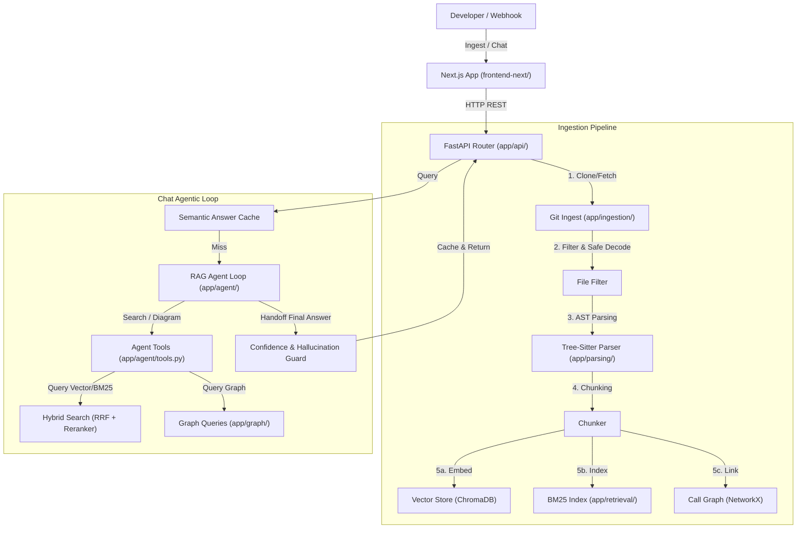

# CodeNavigator - Project Overview & Architecture Guide

Welcome to the **CodeNavigator** project! This system is an agentic, graph-augmented Retrieval-Augmented Generation (RAG) pipeline designed to ingest, index, and explain codebases to developers. 

It provides:
- **Interactive Chat**: Ask complex questions about how a codebase works.
- **Architecture Diagrams**: Generate call graph diagrams for any function or class hierarchy.
- **Semantic Answer Caching**: Instantly serve previous answers for semantically identical questions.
- **Automated Evaluations**: Run RAGAS evaluations and track metric regressions over time.

---

## 1. High-Level Architecture

The project follows a decoupled, client-server architecture with a Python/FastAPI backend and a Next.js frontend. Below is the system interaction graph:



---

## 2. Directory & Component Structure

Here is a breakdown of the source files in the `app` package:

```text
app/
├── main.py                     # FastAPI application bootstrap & exception handlers
├── config.py                   # Pydantic configuration & environment settings
│
├── api/
│   └── router.py               # REST endpoints (/ingest, /status, /chat, /diagram, /eval)
│
├── ingestion/
│   ├── clone.py                # Git downloader, size/privacy filters & local fallback logic
│   ├── file_filter.py          # Language detectors (Python, JS, TS) and code-safety decoders
│   ├── locking.py              # Thread-safe write locks during ingestion
│   └── metadata_store.py       # Persistence of sync job status, commit hashes, and aliases
│
├── parsing/
│   ├── tree_sitter_parser.py   # Tree-Sitter AST parsing of classes, functions, and imports
│   └── chunker.py              # AST-aware code chunking (split by function/class boundaries)
│
├── retrieval/
│   ├── embeddings.py           # Text embedding interface using SentenceTransformers
│   ├── vector_store.py         # ChromaDB client wrapper for semantic search index
│   ├── bm25_store.py           # BM25 keyword search index on code tokens
│   ├── query_expansion.py      # LLM-assisted query generation for better code retrieval
│   ├── hybrid_search.py        # Reciprocal Rank Fusion (RRF) combiner
│   └── reranker.py             # CrossEncoder reranking for top matches
│
├── graph/
│   ├── builder.py              # NetworkX call graph builder (adds import & call edges)
│   └── queries.py              # BFS call-tree traversers & timeout-safe cycle detectors
│
├── diagrams/
│   └── mermaid_generator.py    # Converts subgraphs into clean Mermaid.js visual syntax
│
├── agent/
│   ├── loop.py                 # Core agentic RAG loop (iterative tool call logic, timeouts)
│   ├── tools.py                # Wrapper tools (search_code, generate_diagram, read_file)
│   ├── system_prompt.py        # Agent guidelines, rules, and hallucination instructions
│   ├── cache_keys.py           # Normalization and order-invariance checks for tool caching
│   ├── confidence.py           # Source citation parser & LLM confidence scoring (gating)
│   └── semantic_cache.py       # ChromaDB semantic cache for answers (0.95 similarity threshold)
│
├── evaluation/
│   ├── run_eval.py             # RAGAS evaluation runner
│   ├── compare_runs.py         # Run-to-run metric comparison & regression analysis
│   └── ragas_providers.py      # Mock / live adapters for evaluation providers
│
├── webhook/
│   └── github_webhook.py       # PR webhook listener that triggers automated re-ingestion
│
└── observability/
    └── logging_config.py       # Structlog configuration for json-structured logging
```

---

## 3. Key Pipeline Lifecycles

### Ingestion Pipeline
1. **Trigger**: User calls `POST /ingest` with a repository URL.
2. **Synchronous Validation**:
   - Validates the repository URL syntax.
   - Clones/downloads the repository. If offline, copies the local fallback requests repository.
   - Inspects total file sizes and checks if the repository requires credential access (PAT).
   - Scans and filters out non-supported files (retaining Python, JS, and TS files).
3. **Asynchronous Background Processing**:
   - Parsers extract AST blocks (classes, functions, import definitions).
   - Chunks are created at AST boundaries.
   - Text embeddings are generated and stored in ChromaDB; keywords are indexed in BM25.
   - Import structures are linked to build a Call Graph (NetworkX), serialized to `graph.json`.
   - The sync status file updates to `"synced"`.

### Chat Pipeline (Agentic RAG)
1. **Semantic Cache Check**:
   - The question is embedded and queried against the ChromaDB Semantic Cache.
   - If a cached answer exists with a similarity $> 0.95$ and matching git commit hash, it is returned immediately (cache hit).
2. **Agent Initialization**:
   - If it's a cache miss, the RAG loop initializes with a system prompt.
   - Default budgets: `max_iterations = 3`, `max_tool_calls = 4`, `max_wall_seconds = 90.0`.
3. **Iterative Tool Execution**:
   - The agent (LLM) decides to call tools like `search_code`, `read_file`, or `generate_diagram`.
   - Each `search_code` call executes **Hybrid Search** (vector cosine similarity + BM25 keyword matching) consolidated via **RRF (Reciprocal Rank Fusion)** and sorted with a **Cross-Encoder Reranker**.
   - If the token budget exceeds the nominal limits, older tool results are compressed into summaries to preserve context space.
   - If the execution time passes the 90.0s deadline, the agent gracefully aborts and returns a timeout response.
4. **Validation and Handoff**:
   - The final output is checked by a **Hallucination Guard**: any file path links or line-range citations are parsed and checked against the actual files in the repository. If any references are hallucinated or the LLM's introspection confidence score is $< 4.0$, the response is gated.
   - Gated, rate-limited, and timed-out results are flagged and **skipped** from entering the semantic cache.
   - Valid answers are saved to the cache and returned to the client.

---

## 4. How to Get Started

### Prerequisites
- Python 3.12
- Windows / Linux environment
- Git

### Installation
1. Setup Python virtual environment:
   ```bash
   python -m venv .venv
   .venv\Scripts\activate   # Windows
   source .venv/bin/activate # Linux/Mac
   ```
2. Install dependencies:
   ```bash
   pip install -r requirements.txt
   ```
3. Set up environment variables:
   Copy `.env.example` to `.env` and fill in the required keys:
   ```env
   GROQ_API_KEY="your_groq_api_key"
   LLM_PROVIDER="groq"
   EMBEDDING_MODEL="sentence-transformers/all-MiniLM-L6-v2"
   ```

### Running the Services
Start the server and frontend using the local runner script:
```cmd
run_local.bat
```
Or start them manually in separate shells:
- **Backend (FastAPI)**:
  ```bash
  python -m uvicorn app.main:app --port 8000 --reload
  ```
- **Frontend (Next.js)**:
  ```bash
  cd frontend-next && npm install && npm run dev
  ```

### Running Tests
Execute the unit and integration tests using pytest:
```bash
pytest tests/ --ignore=tests/test_golden_set.py
```
*(Note: `test_golden_set.py` performs live API calls on real code repositories and requires API quota).*
