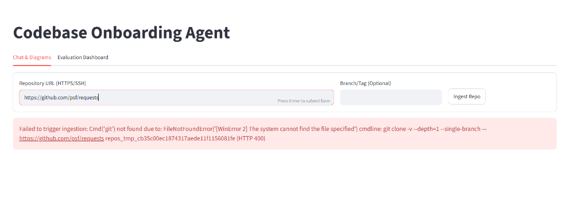
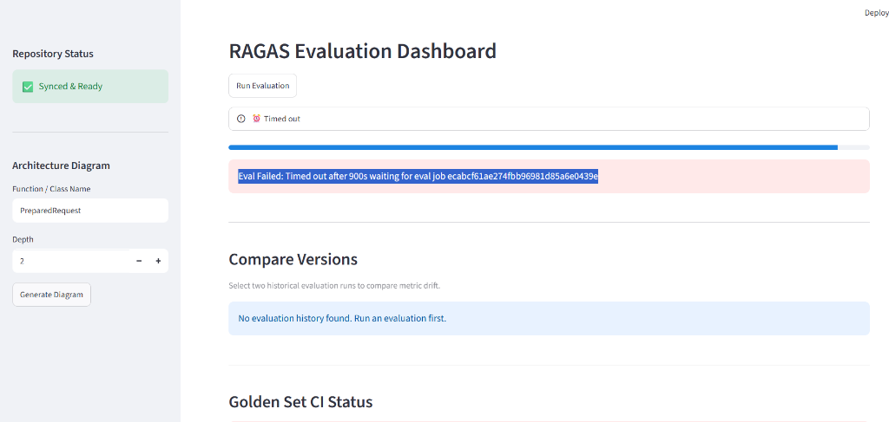

# CodeNavigator

CodeNavigator is an autonomous, AI-powered codebase onboarding agent designed to solve a critical problem for developers: losing days trying to understand unfamiliar codebases. By ingesting a GitHub repository and building a graph-augmented vector index, CodeNavigator allows you to ask complex, natural-language questions about how the code works and instantly receive precise, citation-grounded answers.

## Features

- **Hybrid Retrieval:** Combines semantic vector similarity with exact BM25 keyword matching for unparalleled search accuracy across code tokens and documentation.
- **Cross-Encoder Reranking:** Dynamically evaluates and reorders the top search results to ensure the LLM receives only the most highly relevant context.
- **Call-Graph Analysis:** Analyzes imports and function invocations to trace logic execution through a strict NetworkX graph (up to 3 hops).
- **Architecture Diagrams:** Automatically generates interactive Mermaid.js architecture and call-graph diagrams for any entry point in the repository.
- **Confidence-Gated Answers:** Employs a strict Hallucination Guard that validates every cited file and line range. If the agent isn't highly confident, it refuses to answer rather than hallucinating.
- **Semantic Answer Caching:** Caches previous answers. Semantically identical questions hit the cache instantly, reducing token costs and latency.
- **Automated Re-Ingest (Webhooks):** Listens to GitHub PR merges to automatically re-clone, re-index, and invalidate caches, ensuring the agent is never out of sync with the `main` branch.
- **RAGAS Evaluation Dashboard:** Built-in tools for rigorous pipeline evaluation (Faithfulness, Answer Relevancy, Context Precision/Recall) against a Golden Set.

## ⚡ Zero-Cost Infrastructure

CodeNavigator is engineered to run entirely on **free-tier and local infrastructure**. You do not need expensive paid APIs to operate this system:
- **LLM Reasoning:** Runs on the generous Groq free tier (or local Ollama instances).
- **Embeddings:** Uses local, open-source `sentence-transformers` via HuggingFace.
- **Vector DB:** Uses local, persistent ChromaDB.
- **Keyword Search:** Uses a custom, pure-Python local BM25 implementation.

## Tech Stack

- **Backend:** FastAPI, Pydantic, Python 3.12
- **Frontend:** Streamlit
- **Parsing:** Tree-Sitter (AST extraction for Python, JS, TS)
- **Vector Search:** ChromaDB, SentenceTransformers (`all-MiniLM-L6-v2`)
- **Agentic Loop:** Custom iterative RAG loop, NetworkX, RRF (Reciprocal Rank Fusion)

## Quick Start

Get CodeNavigator running locally in under 5 minutes:

```bash
# 1. Clone the repository
git clone https://github.com/<your-username>/codenavigator.git
cd codenavigator

# 2. Setup your environment variables
cp .env.example .env
# Edit .env and add your free Groq API key (GROQ_API_KEY)

# 3. Build and run via Docker Compose
docker compose up --build
```

Once the containers are running, open your browser to **[http://localhost:8501](http://localhost:8501)** to access the Streamlit UI!

## Demo

Here is a glimpse of CodeNavigator in action:

**Agentic Chat Interface**  


**Automated Mermaid Architecture Diagrams**  


## Architecture Overview

CodeNavigator operates via a decoupled pipeline:

1. **Ingest & Parse:** Git clones the repo, filters unsupported files, and uses Tree-sitter to chunk code precisely at Class and Function boundaries.
2. **Index:** Chunks are simultaneously embedded into ChromaDB (Vectors) and tokenized into BM25 (Keywords). Imports and calls are mapped into a NetworkX Graph.
3. **Agent Loop:** When a question is asked, the agent autonomously decides whether to execute Hybrid Searches (`search_code`), traverse the graph (`get_callers`), or read specific files.
4. **Confidence Gate:** The final synthesized answer is vetted for hallucinatory paths and line-numbers before being served and cached.
