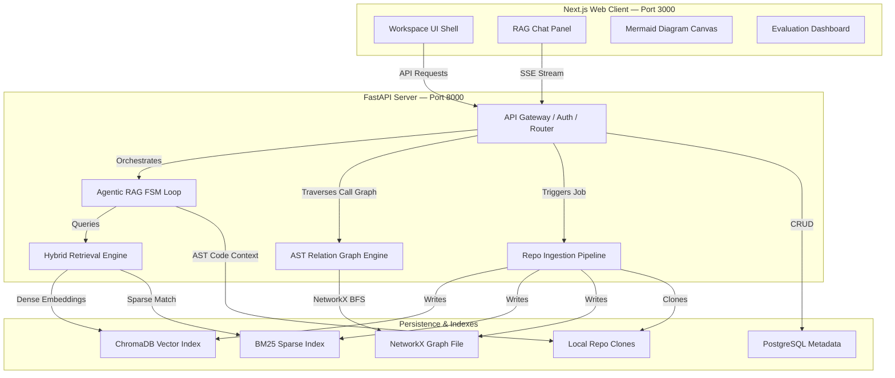

<div align="center">


<br/>

<b>Ask any question about any codebase. Get a grounded, cited answer in seconds — not hours of grepping.</b>

<br/><br/>

[](#-license--intellectual-property)
[](#-tech-stack)
[](#-tech-stack)
[](#-tech-stack)
[](#-roadmap)

<br/>


<br/>


<br/><br/>

</div>

---

<details open>
<summary><b>📋 Table of Contents</b></summary>
<br/>

| # | Section | # | Section |
|---|---------|---|---------|
| 1 | [About the Project](#-about-the-project) | 9 | [Design System](#-design-system) |
| 2 | [Features](#-features) | 10 | [Directory Map](#-directory-map) |
| 3 | [System Architecture](#-system-architecture) | 11 | [Setup & Local Execution](#-setup--local-execution) |
| 4 | [Agentic FSM Loop](#-the-agentic-fsm-loop) | 12 | [Testing & Evaluation](#-testing--evaluation) |
| 5 | [Hybrid Retrieval Engine](#-hybrid-retrieval-engine-rrf) | 13 | [Engineering Notes](#-engineering-notes) |
| 6 | [Hallucination Guard](#-hallucination-guard) | 14 | [Roadmap](#-roadmap) |
| 7 | [IP-Protected Prompt Loader](#-ip-protected-prompt-loader) | 15 | [License & IP](#-license--intellectual-property) |
| 8 | [API Reference](#-api-reference) | 16 | [Author](#-author) |

</details>

---

## 🧠 About the Project

**Onboarding onto an unfamiliar codebase is slow.** Engineers lose days tracing call chains, reading documentation that's already stale, and pinging senior developers for context that interrupts everyone's flow.

**CodeNavigator** is an agentic RAG platform that removes that friction. Point it at a repository and it builds a **triple index** — dense embeddings, sparse keyword search, and a structural call graph — then exposes an autonomous FSM-driven agent that answers precise, source-grounded questions about how the code actually works.

This isn't a thin LLM wrapper. It's a deterministic agent loop with a hard verification stage: every citation the model produces is checked against the real file system before it's allowed to reach the user.

|  | The Old Way | CodeNavigator |
|---|---|---|
| 📖 | Read docs that drift out of sync with the code | Answers are generated live from the indexed source |
| 🔍 | Grep and manually trace function calls | The graph engine resolves callers/callees via NetworkX BFS |
| 🙋 | Interrupt a senior engineer to ask "where does X happen?" | Ask the agent — it cites the exact file and line range |
| 🤞 | Trust an LLM's confident-sounding but unverified answer | Every citation is checked against the index; low-confidence answers are gated |

---

## ✨ Features

<div align="center">

| | Feature | Description |
|---|---|---|
| 🤖 | **Agentic FSM Loop** | A deterministic `PLAN → ACT → OBSERVE → DECIDE → VERIFY → RESPOND` state machine — the LLM decides what to do next, but the loop structure prevents runaway or ungrounded behavior |
| 🔀 | **Hybrid Retrieval** | ChromaDB dense vectors + BM25 sparse keyword search, fused with Reciprocal Rank Fusion (RRF) |
| 🕸️ | **AST Relation Graph** | Tree-sitter parses the codebase into a NetworkX graph of classes, methods, and call relationships |
| 🛡️ | **Hallucination Guard** | Every markdown citation in the final answer is validated — file existence, line-range bounds — and scored before it's released to the user |
| 📊 | **Mermaid Diagrams** | Call subgraphs are traversed and rendered as Mermaid flowcharts directly in the chat/canvas UI |
| ⚡ | **Semantic Answer Cache** | Embedding-based cache serves repeated questions instantly within the same commit version |
| 🔒 | **IP-Protected Prompts** | A dynamic loader reads proprietary prompt templates from a private directory when present, falling back to safe operational defaults otherwise |
| 📈 | **RAGAS Evaluation** | Automated Faithfulness / Relevancy / Precision / Recall scoring with hardened retry-backoff against LLM provider rate limits |
| 🌐 | **REST + SSE API** | FastAPI backend with API-key auth, rate limiting, and Server-Sent Events for streaming agent traces and tokens |

</div>

---

## 🏗️ System Architecture

CodeNavigator runs a decoupled client/server architecture. The Next.js frontend talks to the FastAPI backend over REST for standard calls and SSE for streaming agent reasoning traces and tokens.



### Ingestion Pipeline

```
Repo URL Submitted
       │
       ▼
   Clone / Fetch  (app/ingestion/clone.py)
       │
       ▼
   File Filter    (app/ingestion/file_filter.py) — drops binaries, vendor packages, assets
       │
       ▼
   Tree-sitter Parse  (app/parsing/tree_sitter_parser.py) — functions, classes, dependencies
       │
       ▼
  ┌────────────────────────────────────────┐
  │           Parallel Indexing             │
  │  → ChromaDB   (dense embeddings)        │
  │  → BM25 store (sparse keyword index)    │
  │  → NetworkX   (call graph)              │
  └────────────────────────────────────────┘
```

---

## 🔄 The Agentic FSM Loop

The core of CodeNavigator is a **deterministic finite state machine** — not a free-form agent loop — specifically designed to keep the model grounded and bound the number of steps it can take.

```
[PLAN] ──► [ACT (Search / Read)] ──► [OBSERVE] ──► [DECIDE: Iterate?]
                                                          │
                                                          ├──► Yes ──► [PLAN]
                                                          └──► No  ──► [VERIFY] ──► [RESPOND]
```

| State | Responsibility |
|---|---|
| **PLAN** | Chooses the next logical step from the user query and conversation history |
| **ACT** | Invokes one of the agent tools — `search_code`, `view_file_snippet`, `list_calls` |
| **OBSERVE** | Collects and normalizes raw tool output |
| **DECIDE** | Decides whether enough context has been gathered (iteration cap enforced) |
| **VERIFY** | Cross-checks every generated citation against real file/line bounds; sanitizes anything invalid |
| **RESPOND** | Streams the final, grounded answer back to the client |

This is implemented in [`app/agent/loop.py`](file:///d:/github%20project/codebase-onboarding-agent/app/agent/loop.py), with prompts for each state assembled by dedicated formatters — [`plan_prompt.py`](file:///d:/github%20project/codebase-onboarding-agent/app/agent/prompts/plan_prompt.py), [`decide_prompt.py`](file:///d:/github%20project/codebase-onboarding-agent/app/agent/prompts/decide_prompt.py), [`finalize_prompt.py`](file:///d:/github%20project/codebase-onboarding-agent/app/agent/prompts/finalize_prompt.py), and [`compress_prompt.py`](file:///d:/github%20project/codebase-onboarding-agent/app/agent/prompts/compress_prompt.py) — all backed by the [IP-protected prompt loader](#-ip-protected-prompt-loader).

---

## 🔀 Hybrid Retrieval Engine (RRF)

Retrieval fuses semantic vector scores from ChromaDB with keyword ranks from BM25 using **Reciprocal Rank Fusion**, implemented in [`app/retrieval/hybrid_search.py`](file:///d:/github%20project/codebase-onboarding-agent/app/retrieval/hybrid_search.py):

```
RRF_Score(d) = Σ (1 / (k + r_m(d)))   for each retrieval model m in M
```

- **M** — the set of retrieval models (ChromaDB dense vectors, BM25 sparse index)
- **r_m(d)** — the 1-indexed rank of document `d` under model `m`
- **k** — smoothing constant, configured as `60`
- Documents matching test-file patterns (`/tests/`, `test_*.py`) have their rank penalized so implementation source code is prioritized over test scaffolding

---

## 🛡️ Hallucination Guard

Every answer the agent produces passes through a deterministic verification stage before it reaches the user — implemented in [`app/agent/confidence.py`](file:///d:/github%20project/codebase-onboarding-agent/app/agent/confidence.py):

```
Final LLM Answer
       │
       ▼
Parse markdown citations (e.g. `src/auth.py:10-15`)
       │
       ▼
For each citation:
  • Does the file exist in the index?          No → penalize score
  • Are the line numbers within file bounds?   No → penalize score
       │
       ▼
Compute a deterministic confidence score
       │
       ├── Passes threshold → return answer, citations intact
       └── Fails threshold  → strip answer, return a safe fallback
```

Answers are never released on the strength of the model's own confidence — only on a score computed independently from the actual indexed files.

---

## 🔒 IP-Protected Prompt Loader

To keep proprietary system prompts and few-shot answer-quality datasets out of the public repository, [`app/agent/prompts/loader.py`](file:///d:/github%20project/codebase-onboarding-agent/app/agent/prompts/loader.py) implements a fallback pattern:

```
Loader → checks /private/prompts/
       → found     → reads and injects the real templates into the agent loop
       → not found → loads safe, generic fallback strings baked into the code
```

This lets the public repository run end-to-end with sane defaults while the production system uses the proprietary prompt set locally.

---

## 🔌 API Reference

All requests require an `X-API-Key` header when an API key is configured.

| Method | Endpoint | Description | Request Payload | Response |
|---|---|---|---|---|
| `POST` | `/api/ingest` | Starts repository ingestion | `{ "url": "string" }` | `{ "job_id": "string", "status": "processing" }` |
| `GET` | `/api/ingest/status/{job_id}` | Polls ingestion pipeline progress | — | `{ "status": "ready\|processing\|failed", "files_parsed": 12, ... }` |
| `POST` | `/api/chat` | Queries the RAG FSM agent | `{ "message": "string", "repo_id": "string" }` | SSE stream — events: `state`, `token`, `done`, `error` |
| `GET` | `/api/symbols/{repo_id}` | Lists indexed AST symbol definitions | — | `[{ "name": "string", "path": "string", "start_line": 10 }]` |
| `GET` | `/api/diagram/{repo_id}` | Traverses method calls into a Mermaid diagram | Query: `symbol_name`, `depth` | `{ "mermaid_code": "string" }` |
| `GET` | `/api/file-snippet/{repo_id}` | Fetches a bounded code snippet | Query: `file_path`, `start_line`, `end_line` | `{ "code": "string", "start_line": 5, "end_line": 25 }` |
| `POST` | `/api/eval/run` | Triggers a RAGAS evaluation run | Query: `repo_id` | `{ "job_id": "string", "status": "started" }` |

---

## 🎨 Design System

CodeNavigator ships a custom **"Midnight Studio"** dark theme, defined in [`frontend-next/app/globals.css`](file:///d:/github%20project/codebase-onboarding-agent/frontend-next/app/globals.css):

```css
:root {
  --background: 240 10% 3.9%;      /* Deep Charcoal */
  --foreground: 0 0% 98%;          /* Clean White */
  --card: 240 10% 5.9%;            /* Matte Gray */
  --border: 240 5.9% 15%;          /* Fine Border Accent */

  --primary: 263.4 70% 50.4%;      /* Royal Violet #8b5cf6 */
  --primary-foreground: 210 20% 98%;

  --success: 142.1 76.2% 36.3%;    /* Forest Green */
  --warning: 37.9 90.2% 50.2%;     /* Warning Amber */
  --destructive: 0 72.2% 50.6%;    /* Alert Red */
}
```

---

## 🛠️ Tech Stack

<div align="center">

| Layer | Technology | Role |
|---|---|---|
| **Backend** | FastAPI | REST API, SSE streaming, background ingestion jobs |
| **Frontend** | Next.js | Chat panel, Mermaid diagram canvas, evaluation dashboard |
| **LLM Inference** | Groq | Agent reasoning and answer generation |
| **Vector Store** | ChromaDB | Dense embedding storage and semantic search |
| **Keyword Index** | BM25 (custom) | Exact-match symbol / keyword search |
| **Graph Engine** | NetworkX | Call graph modeling and BFS traversal |
| **AST Parser** | Tree-sitter | Language-aware function/class extraction |
| **Metadata DB** | PostgreSQL | Job, repo, and evaluation metadata |
| **Evaluation** | RAGAS | Faithfulness, relevancy, precision, recall scoring |
| **Diagrams** | Mermaid.js | Call-graph visualization |
| **Payments** | Stripe | Pricing plans and billing meters (`app/platform/billing/`) |

</div>

---

## 📁 Directory Map

```
codebase-onboarding-agent/
│
├── app/
│   ├── main.py                         ← FastAPI entry point, middleware, lifecycle
│   ├── config.py                       ← Pydantic Settings (env-driven config)
│   │
│   ├── api/
│   │   ├── router.py                   ← Ingestion / chat / graph / snippet / eval / billing routes
│   │   ├── auth.py                     ← API key + multi-tenant auth
│   │   ├── rate_limiter.py             ← Slotted-bucket rate limiting
│   │   └── state_stream.py             ← SSE generator for agent traces + tokens
│   │
│   ├── agent/
│   │   ├── loop.py                     ← FSM agent loop (PLAN→ACT→OBSERVE→DECIDE→VERIFY→RESPOND)
│   │   ├── tools.py                    ← search_code / view_file_snippet / list_calls
│   │   ├── confidence.py               ← Hallucination Guard
│   │   ├── semantic_cache.py           ← Embedding-based answer cache
│   │   └── prompts/
│   │       ├── loader.py               ← IP-protected prompt loader
│   │       ├── plan_prompt.py
│   │       ├── decide_prompt.py
│   │       ├── finalize_prompt.py
│   │       ├── compress_prompt.py
│   │       └── answer_quality_dataset.py
│   │
│   ├── retrieval/
│   │   ├── embeddings.py               ← SentenceTransformers dense embeddings
│   │   ├── vector_store.py             ← ChromaDB client manager
│   │   ├── bm25_store.py               ← BM25 sparse index
│   │   └── hybrid_search.py            ← RRF fusion + test-file demotion
│   │
│   ├── graph/
│   │   └── builder.py                  ← NetworkX graph builder (classes, scopes, calls)
│   │
│   ├── diagrams/
│   │   └── mermaid_generator.py        ← AST subgraph → Mermaid flowchart
│   │
│   ├── ingestion/
│   │   ├── clone.py                    ← Git URL resolution + auth + cloning
│   │   └── file_filter.py              ← Source vs. vendor/asset filtering
│   │
│   ├── parsing/
│   │   └── tree_sitter_parser.py       ← AST extraction (functions, classes, deps)
│   │
│   └── platform/
│       └── billing/                    ← Stripe payment + subscription management
│
├── frontend-next/
│   └── app/
│       ├── layout.tsx                  ← Global shell, fonts, theme providers
│       ├── globals.css                 ← Midnight Studio theme
│       ├── onboarding/page.tsx         ← Repo ingestion wizard
│       ├── chat/page.tsx               ← Agent RAG dialog window
│       ├── architecture/page.tsx       ← Call-graph canvas + inspector
│       └── evaluation/page.tsx         ← RAGAS score history + CI checks
│
├── eval/
│   ├── run_eval.py                     ← RAGAS evaluation runner (429-hardened)
│   └── ragas_providers.py              ← ChatGroq judge with retry-backoff
│
├── tests/                              ← Full pytest suite
└── start.bat                           ← One-command local startup
```

---

## 🚀 Setup & Local Execution

### Prerequisites

```bash
python --version   # 3.12+
node --version     # 18+
```

### Installation

```bash
# 1. Clone the repository
git clone https://github.com/HurairaMaqbool/codebase-onboarding-agent.git
cd codebase-onboarding-agent

# 2. Create and activate a virtual environment
python -m venv .venv
.venv\Scripts\activate        # Windows
source .venv/bin/activate     # macOS / Linux

# 3. Install backend dependencies
pip install -r requirements.txt

# 4. Install frontend dependencies
cd frontend-next && npm install && cd ..

# 5. Configure environment variables
cp .env.example .env
```

Edit `.env` with your keys (`GROQ_API_KEY`, `POSTGRES_URI`, `REPOS_PATH`, model selections, search thresholds — see `app/config.py`).

### Run

```bash
# One command (Windows) — launches backend (8000) + frontend (3000)
start.bat

# Or manually, in two terminals:
uvicorn app.main:app --host 0.0.0.0 --port 8000    # Terminal 1
cd frontend-next && npm run dev                      # Terminal 2
```

| Service | URL |
|---|---|
| FastAPI Backend | http://localhost:8000 |
| API Docs (Swagger) | http://localhost:8000/docs |
| Next.js Frontend | http://localhost:3000 |

---

## 🧪 Testing & Evaluation

```bash
# Full test suite
pytest

# RAGAS evaluation on the golden set
python -m eval.run_eval <repo_id>

# Production frontend build
cd frontend-next && npm run build
```

RAGAS tracks **Faithfulness**, **Answer Relevancy**, **Context Precision**, and **Context Recall**, with rate-limit-hardened retries: `eval/run_eval.py` parses Groq's own rate-limit hints and backs off exponentially (capped at 20s, up to 5 attempts), while `eval/ragas_providers.py` configures the judge model's own client-level retry handling rather than disabling it.

---

## 📝 Engineering Notes

A running log of non-trivial issues resolved during development — kept here rather than buried in commit history:

| # | Issue | Resolution |
|---|---|---|
| 1 | Sidebar vertical scroll breaking on long content | Fixed-positioning container restructure |
| 2 | Symbol search dropdown clipped under other panels | Applied `relative z-50` stacking wrappers |
| 3 | RAGAS chart TypeScript compile failures | Added type guards around Recharts label parsing |
| 4 | Inconsistent leading-slash paths in symbol inspector | Normalized via `.lstrip('/')` |
| 5 | Rate-limit retry loop never terminating | Raised backoff ceiling and adjusted sleep thresholds |
| 6 | RAGAS judge hitting provider rate limits | Set `max_retries > 0` on the RAGAS `ChatGroq` client |
| 7 | Evaluation "compare runs" missing older records | Matched legacy evaluations lacking `repo_id` by job ID instead |

---

## 🛣️ Roadmap

```
✅  Phase 1 — Core Pipeline
    [x] Git ingestion + Tree-sitter AST chunking
    [x] Triple indexing — ChromaDB + BM25 + NetworkX
    [x] Hybrid search with Reciprocal Rank Fusion
    [x] Deterministic agentic FSM loop

✅  Phase 2 — Safety & Reliability
    [x] Hallucination Guard with citation validation
    [x] Semantic answer cache
    [x] IP-protected prompt loader with safe fallbacks
    [x] Rate-limit-hardened RAGAS evaluation

🔄  Phase 3 — Evaluation & Observability  (in progress)
    [ ] Expanded RAGAS golden set
    [ ] Tracing / observability integration
    [ ] Automated regression detection

🔮  Phase 4 — Extensions
    [ ] Additional Tree-sitter language grammars
    [ ] Multi-repo cross-codebase queries
    [ ] Containerized deployment + CI/CD
```

---

## 📄 License & Intellectual Property

**Copyright © 2026 Huraira Maqbool. All Rights Reserved.**

This repository — including the agentic FSM loop, prompt engineering templates, confidence-gating logic, retrieval algorithms, and system architecture — is the proprietary work of the author and is published for **learning, demonstration, and portfolio evaluation only**.

- 🚫 **No commercial use** without express written permission
- 🚫 **No redistribution** or rehosting of this codebase or derivatives
- 🚫 **No reuse** of the prompting structure or retrieval systems without consent

For licensing or collaboration inquiries: **hurairac37@gmail.com**

---

## 👤 Author

<div align="center">


### **Huraira Maqbool**
*AI Engineer · Agentic RAG Systems · LangChain · LangGraph*

[](https://github.com/HurairaMaqbool)
[](https://www.linkedin.com/in/huraira-maqbool-b696a5277/)
[](mailto:hurairac37@gmail.com)

<br/>

*If CodeNavigator saved you time understanding a codebase, a ⭐ on GitHub helps other engineers find it.*

</div>

<div align="center">


<sub>Built with 🐍 Python · ⚡ FastAPI · 🧠 Agentic RAG · 🕸️ NetworkX</sub>
</div>
