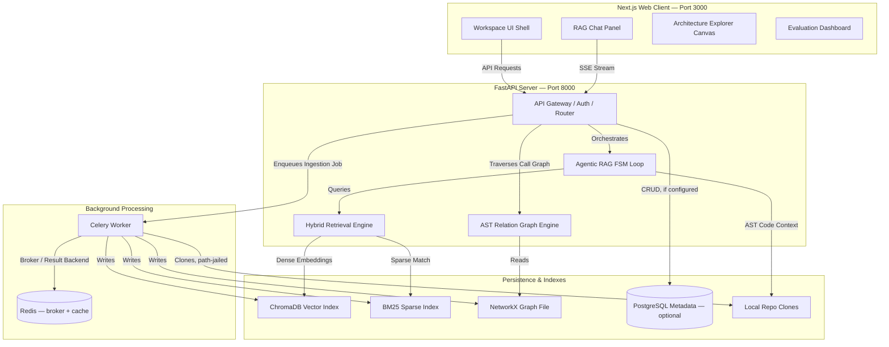

<div align="center">


<br/>

<b>Ask a question about an ingested codebase. Get a cited answer grounded in the actual file, AST symbol, and call graph — or an explicit refusal when the verification gate can't confirm it.</b>

<br/><br/>

[](#license--intellectual-property)
[](#tech-stack)
[](#tech-stack)
[](#tech-stack)
[](#research-evaluation--results)

<br/>

[](https://github.com/HurairaMaqbool)
[](https://www.linkedin.com/in/huraira-maqbool-b696a5277/)
[](mailto:hurairac37@gmail.com)

<br/>


<br/>


<br/><br/>

</div>

---

<details open>
<summary><b>Table of Contents</b></summary>
<br/>

| # | Section | # | Section |
|---|---------|---|---------|
| 1 | [About the Project](#about-the-project) | 13 | [Setup & Local Execution](#setup--local-execution) |
| 2 | [Research Evaluation & Results](#research-evaluation--results) | 14 | [Docker & Kubernetes](#docker--kubernetes) |
| 3 | [Features](#features) | 15 | [Environment Variables](#environment-variables) |
| 4 | [System Architecture](#system-architecture) | 16 | [Testing & Evaluation](#testing--evaluation) |
| 5 | [Agentic FSM Loop](#the-agentic-fsm-loop) | 17 | [Limitations](#limitations) |
| 6 | [Hybrid Retrieval Engine](#hybrid-retrieval-engine-rrf) | 18 | [Engineering Notes](#engineering-notes) |
| 7 | [Verification Firewall](#verification-firewall) | 19 | [Roadmap](#roadmap) |
| 8 | [IP-Protected Prompt Loader](#ip-protected-prompt-loader) | 20 | [License & IP](#license--intellectual-property) |
| 9 | [Async Ingestion & Webhooks](#async-ingestion--webhooks) | 21 | [Author](#author) |
| 10 | [Auth & Multi-Tenancy](#auth--multi-tenancy) | | |
| 11 | [Observability](#observability) | | |
| 12 | [API Reference](#api-reference) | | |

</details>

---

## About the Project

Onboarding onto an unfamiliar codebase is slow. Engineers lose hours tracing call chains, reading documentation that has already drifted from the code, and interrupting senior developers just to get oriented.

**CodeNavigator** is a repository-level code question-answering system. Point it at a repository and it builds a **triple index** — dense embeddings, sparse keyword search, and a structural call graph — then runs an autonomous, FSM-driven agent that answers questions about the codebase and cites the exact file and line range each claim came from.

It is not a thin LLM wrapper around a codebase. It runs a deterministic agent loop with a dedicated verification stage: every claim is checked against the real file system, the AST, and the call graph before it reaches the user. When the verification gate can't confirm a claim, the system withholds the answer instead of guessing — the [evaluation section below](#research-evaluation--results) reports exactly how often that happens, why, and the cases where the trade-off doesn't work in the system's favor.

| | The Old Way | CodeNavigator |
|---|---|---|
| 📖 | Read docs that drift out of sync with the code | Answers are generated live from the indexed source |
| 🔍 | Grep and manually trace function calls | The graph engine resolves callers/callees via graph traversal |
| 🙋 | Interrupt a senior engineer to ask "where does X happen?" | Ask the agent — it cites the exact file and line range |
| 🤞 | Trust an LLM's confident-sounding but unverified answer | Claims are checked before release; unconfirmed answers are withheld, not guessed |

---

## Research Evaluation & Results

CodeNavigator has been evaluated in a controlled, paired comparison against a naive dense-RAG baseline, written up as a full manuscript (*CodeNavigator: Agentic Graph-Augmented Retrieval-Augmented Generation for Repository-Level Code Question Answering*). This section reports the headline numbers; the manuscript is the authoritative source on the statistics, threats to validity, and reproducibility gaps.

*Table: 27-query paired benchmark, single repository, single LLM/provider.*

| Metric | CodeNavigator | Dense-only baseline |
|---|---:|---:|
| Hit@5 (retrieval coverage) | 26/27 (96.3%) | 23/27 (85.2%) |
| Accepted-answer accuracy (ungated) | 5/27 (18.5%) | 21/27 (77.8%) |
| Abstention rate | 21/27 (77.8%) | 0/27 (0%) |
| Mean observed latency | 28.53 s | 12.87 s |

**Read this table carefully — it is not a simple win.** CodeNavigator's hybrid retrieval finds the right file more often than dense-only search, but its verification gate abstains on more than three-quarters of queries, so its accepted-answer rate falls well below the baseline's. That gap reflects a deliberate design trade-off — withhold unverified answers rather than guess — not evidence that the underlying retrieval or generation is weaker. It does mean, however, that the system answered fewer questions than the baseline in this run.

A paired McNemar test on ungated correctness (b = 0, c = 16) gives a continuity-corrected χ² = 14.06 (p ≈ 1.77 × 10⁻⁴) and an exact binomial p ≈ 3.05 × 10⁻⁵ — both indicating a statistically significant difference in ungated-correct counts, though neither isolates whether that difference stems from retrieval, generation, or the abstention policy itself.

**Three confounds qualify these numbers, and none are buried in the fine print:**

- **Cache contamination.** Four of the five ungated-correct CodeNavigator answers returned in under 0.15 seconds — consistent with semantic-cache hits from a prior run rather than live pipeline execution. The confirmed-live positive-evidence floor may be as low as **2 of 27** queries, pending a cold-cache re-run with per-query cache logging.
- **Latency confound.** 465 of the reported 770 total seconds of CodeNavigator's run (60.4%) were disclosed Groq rate-limit backoff sleep, not compute. Netting that out gives a compute-only mean of roughly 11.3 s/query — at or below the baseline's 12.87 s — though this can't be confirmed without knowing whether the baseline also carried undisclosed wait time.
- **Abstention root cause.** The 77.8% abstention rate traces, by the author's analysis, to an incompatibility between the model's `<think>` reasoning output and the API provider's server-side JSON schema enforcement: schema enforcement had to be disabled to avoid request failures, so the citation parser received prose instead of structured JSON and extracted zero citations — pushing confidence below the τ = 4.0 gate threshold. This is the best available explanation, not an independently verified root cause, and is treated as a property of this specific deployment (one model/provider pairing), not of citation-verification gating in general.

No component-level ablation isolates which added component (BM25, RRF, reranking, or graph expansion) drove the retrieval-coverage improvement — all were enabled together in this run. The benchmark's authorship, construction date, and independence from parameter tuning are also undocumented in the available project records and are reported here as an open item rather than assumed. See [Limitations](#limitations) for the full list and the follow-up experiments each one requires.

This repository also ships a separate, lower-stakes RAGAS regression dashboard (`eval/run_eval.py`, `frontend-next/app/evaluation/page.tsx`) for day-to-day retrieval/answer-quality tracking against a small golden set, plus a pytest suite that reported **703 passed / 13 failed / 9 skipped** at last count (2 of the failures are Groq rate-limit flakiness under bulk runs; the rest are pre-existing test-infrastructure debt unrelated to retrieval or grounding). Numbers from the RAGAS dashboard and from an earlier, differently-scored ablation pass (`experiments/summaries/`) predate the live re-run behind the table above and use a different scoring methodology, so they are not merged with it here. Treat the table above as the current, citable evaluation, and re-run `eval/run_eval.py` for a fresh dashboard reading rather than relying on a hard-coded number in this file.

---

## Features

<div align="center">

| | Feature | Description |
|---|---|---|
| 🤖 | **Agentic FSM Loop** | A deterministic `PLAN → ACT → OBSERVE → DECIDE → VERIFY → RESPOND` state machine — the LLM decides what to do next, but the loop structure bounds how many steps it can take |
| 🔀 | **Hybrid Retrieval** | ChromaDB dense vectors + BM25 sparse keyword search, fused with Reciprocal Rank Fusion (RRF), then re-scored by a cross-encoder reranker |
| 🕸️ | **AST Relation Graph** | Tree-sitter parses Python, JavaScript, and TypeScript into a NetworkX graph of classes, methods, and call relationships, traversed up to a depth of 3 hops |
| 🛡️ | **Multi-Layer Verification Firewall** | Every claim passes structural citation checks, AST symbol grounding, relationship grounding, and confidence scoring before release; claims that fail are stripped or the whole answer is gated |
| 📊 | **Mermaid Diagrams** | Call subgraphs are traversed and rendered as Mermaid flowcharts in the Architecture Explorer |
| ⚡ | **Semantic Answer Cache** | Embedding-based cache scoped to `(repo_id, commit_hash)`, invalidating automatically on a new commit; configurable similarity threshold and TTL |
| 🔒 | **IP-Protected Prompts** | A dynamic loader reads proprietary prompt templates from a private directory when present, falling back to generic defaults otherwise |
| ⏱️ | **Async Ingestion** | Repository cloning, parsing, and indexing run as a Celery task on a dedicated queue, backed by Redis, so the API returns a job ID immediately instead of blocking |
| 🔁 | **Webhook Auto-Reingestion** | An HMAC-verified GitHub webhook re-triggers ingestion on `push` events; a separate GitHub App webhook and a Stripe billing webhook are also wired in |
| 🔑 | **SSO / Multi-Tenant Auth** | Per-org API keys are the default; OIDC and SAML SSO routes exist for enterprise-style login, alongside a small admin console for keys, usage, and billing |
| 📈 | **RAGAS Evaluation** | Automated Faithfulness / Relevancy / Precision / Recall scoring with rate-limit-hardened retries and per-question drill-down |
| 🌐 | **REST + SSE API** | FastAPI backend with API-key auth, atomic quota enforcement, and Server-Sent Events for streaming agent traces and tokens |
| 📡 | **Observability** | OpenTelemetry tracing, a Prometheus `/metrics` endpoint, and optional Sentry error tracking |
| 🔐 | **Hardened Security Boundary** | Path-jailed file access (blocks traversal, UNC-path, and symlink escapes), SSRF-blocked ingestion URLs, and sanitized error responses that never leak internals to the client |

</div>

---

## System Architecture

CodeNavigator runs a decoupled client/server architecture. The Next.js frontend talks to the FastAPI backend over REST for standard calls and SSE for streaming agent reasoning traces and tokens. Ingestion is offloaded to a Celery worker so the API stays responsive during a clone-and-index job.



### Ingestion Pipeline

```
Repo URL Submitted (validated against SSRF / internal-IP targets)
       │
       ▼
   API enqueues a Celery task on the "ingestion" queue (app/tasks/ingestion_task.py)
       │
       ▼
   Clone / Fetch  (app/ingestion/clone.py)
       │
       ▼
   File Filter    (app/ingestion/file_filter.py) — drops binaries, vendor packages, assets
       │
       ▼
   Tree-sitter Parse  (app/parsing/tree_sitter_parser.py) — functions, classes, dependencies
       │
       ▼
  ┌────────────────────────────────────────┐
  │           Parallel Indexing             │
  │  → ChromaDB   (dense embeddings)        │
  │  → BM25 store (sparse keyword index)    │
  │  → NetworkX   (call graph)              │
  └────────────────────────────────────────┘
       │
       ▼
  Re-ingestion auto-detects a prior crashed/incomplete run and forces a
  clean rebuild — no stale chunks silently linger from a failed attempt.
```

---

## The Agentic FSM Loop

The core of CodeNavigator is a **deterministic finite state machine** — not a free-form agent loop — designed to keep the model grounded and bound the number of steps it can take (`MAX_AGENT_ITERATIONS`, default 5; `AGENT_MAX_SECONDS`, default 90).

```
[PLAN] ──► [ACT (Search / Read)] ──► [OBSERVE] ──► [DECIDE: Iterate?]
                                                          │
                                                          ├──► Yes ──► [PLAN]
                                                          └──► No  ──► [VERIFY] ──► [RESPOND]
```

| State | Responsibility |
|---|---|
| **PLAN** | Chooses the next logical step from the user query and conversation history |
| **ACT** | Invokes one of the agent tools — `search_code`, `view_file_snippet`, `list_calls` |
| **OBSERVE** | Collects and normalizes raw tool output |
| **DECIDE** | Decides whether enough context has been gathered (iteration cap enforced) |
| **VERIFY** | Runs every claim through the multi-layer verification firewall before release |
| **RESPOND** | Streams the final, grounded answer back to the client — or a gated abstention if verification fails |

If the LLM provider becomes unreachable mid-loop, the FSM detects the failure explicitly and transitions to a clear error state rather than hanging.

Implemented in `app/agent/loop.py`, with prompts assembled by dedicated formatters (`plan_prompt.py`, `decide_prompt.py`, `finalize_prompt.py`, `compress_prompt.py`) backed by the [IP-protected prompt loader](#ip-protected-prompt-loader).

---

## Hybrid Retrieval Engine (RRF)

Retrieval fuses semantic vector scores from ChromaDB with keyword ranks from BM25 using **Reciprocal Rank Fusion**, implemented in `app/retrieval/hybrid_search.py`:

```
RRF_Score(d) = Σ (1 / (k + r_m(d)))   for each retrieval model m in M
```

- **M** — the set of retrieval models (ChromaDB dense vectors, BM25 sparse index)
- **r_m(d)** — the 1-indexed rank of document `d` under model `m`
- **k** — smoothing constant, configured as `60` (`RRF_K`)
- Documents matching test-file patterns (`/tests/`, `test_*.py`) have their rank penalized so implementation source code is prioritized over test scaffolding
- Top candidates (`HYBRID_SEARCH_TOP_K`, default 20) are re-scored by a cross-encoder reranker (`cross-encoder/ms-marco-MiniLM-L-6-v2`) down to a final set (`RERANK_TOP_N`, default 8) before reaching the agent

No component-level ablation currently isolates how much of the retrieval-coverage result in the [evaluation section](#research-evaluation--results) comes from BM25, RRF, or the reranker individually — see [Limitations](#limitations).

---

## Verification Firewall

Every answer passes through a deterministic, multi-layer grounding check before it reaches the user — implemented in `app/agent/claim_verification.py`:

```
Final LLM Claims
       │
       ▼
Abstention & citation-presence check
       │
       ▼
Structural check — does the cited file/line range actually exist?
       │
       ▼
Lexical overlap + embedding confidence scoring
       │
       ▼
AST symbol grounding — does the claimed symbol exist in the cited code?
       │
       ▼
Relationship & literal grounding — do claimed call relationships and
literals actually appear in the graph / cited text?
       │
       ▼
Question-responsiveness & library-hallucination checks
       │
       ├── All layers pass, confidence ≥ τ (default 4.0) → return answer, citations intact
       └── Any layer fails, or confidence < τ            → strip the claim or gate the response
```

An answer being gated means the firewall could not confirm it — it does not by itself mean the withheld answer was wrong. That distinction, and how often gating happens in practice, is covered in [Research Evaluation & Results](#research-evaluation--results): in the formal benchmark, this gate withheld an answer on 77.8% of queries, driven substantially by one structured-output parsing issue rather than by citations being unavailable. Treat "verification gate" as a component that trades availability for a stronger correctness guarantee, not as a guarantee that CodeNavigator never hallucinates.

---

## IP-Protected Prompt Loader

To keep proprietary system prompts and few-shot answer-quality datasets out of the public repository, `app/agent/prompts/loader.py` implements a fallback pattern:

```
Loader → checks /private/prompts/
       → found     → reads and injects the real templates into the agent loop
       → not found → loads safe, generic fallback strings baked into the code
```

This lets the public repository run end-to-end with sane defaults while the production system uses the proprietary prompt set locally.

---

## Async Ingestion & Webhooks

Ingestion does not run in the request thread. `POST /ingest` enqueues a Celery task (`app/tasks/ingestion_task.py`) onto a dedicated `ingestion` queue backed by Redis (`app/tasks/celery_app.py`); the client polls `GET /status/{job_id}` for progress. Running a worker (`celery -A app.tasks.celery_app worker -Q ingestion`) is required for ingestion jobs to actually process — the API accepting a job does not mean a worker is consuming it.

Three HMAC/signature-verified webhook receivers live under `app/webhook/`:

| Webhook | Trigger | Effect |
|---|---|---|
| `github_webhook.py` | GitHub `push` event, HMAC-SHA256 verified | Re-enqueues ingestion for the affected repository; ignores non-push events |
| `github_app_webhook.py` | GitHub App installation events | GitHub App–based auth flow for private repositories |
| `stripe_webhook.py` | Stripe billing events | Keeps subscription/plan state in sync for the billing platform |

Duplicate webhook deliveries are de-duplicated (`app/webhook/delivery_guard.py`) before they reach the ingestion orchestrator.

---

## Auth & Multi-Tenancy

The default auth path is a per-organization API key sent as `X-API-Key`, enforced by `app/auth` and `app/api/auth.py`, with atomic (check-and-increment) quota enforcement so concurrent requests can't race past a plan's limit.

Beyond API keys, the repository also wires in:

- **OIDC SSO** (`app/auth/oidc.py`, `oidc_jwks.py`) — external identity-provider login, intended for enterprise-style access rather than the default local-dev path.
- **SAML SSO** — present as a configurable, optional route (`SAML_ENABLED` in `.env.example`); OIDC is the preferred path for a standard setup.
- **Admin console** (`admin/`) — a small Vite + React app (see `admin/src/App.tsx`) for managing API keys, viewing usage/billing, and reading the audit log through the `/platform/*` and `/billing/*` endpoints. It is a separate app from the main Next.js frontend and is not started by `start.bat`.

None of this authentication surface has been part of the research evaluation above — it is platform/product infrastructure, evaluated separately (or not yet) from the retrieval-and-verification pipeline the manuscript covers.

---

## Observability

Wired into `app/main.py`:

- **Tracing** — OpenTelemetry SDK with OTLP export (`app/observability/tracing.py`), instrumenting FastAPI.
- **Metrics** — `prometheus-fastapi-instrumentator` exposes a `/metrics` endpoint.
- **Structured logging** — `structlog`-based logging (`app/observability/logging_config.py`).
- **Error tracking** — Sentry SDK initialization is present and optional (only activates if a Sentry DSN is configured).
- **Health/readiness** — `/health` and `/ready` endpoints for container orchestration liveness/readiness probes.

None of this is described in the research manuscript; it is deployment/platform tooling around the core RAG pipeline, not part of what was evaluated.

---

## API Reference

All endpoints below are unprefixed (there is no `/api` base path) and require an `X-API-Key` header when an API key is configured, except `/health`, `/ready`, and `/status/public`.

| Method | Endpoint | Description | Request Payload | Response |
|---|---|---|---|---|
| `POST` | `/ingest` | Enqueues repository ingestion as a Celery task (auto-detects and cleans up any prior incomplete run) | `{ "url": "string" }` | `202` — `{ "job_id": "string", "status": "processing" }` |
| `GET` | `/status/{job_id}` | Polls ingestion job progress | — | `{ "status": "ready\|processing\|failed", ... }` |
| `POST` | `/chat` | Queries the RAG FSM agent | `{ "message": "string", "repo_id": "string" }` | Chat response |
| `GET` | `/chat/stream/{session_id}` | Streams agent reasoning and tokens | — | SSE stream — events: `state`, `token`, `done`, `error` |
| `GET` | `/symbols/{repo_id}` | Lists indexed AST symbol definitions | — | `[{ "name": "string", "path": "string", "start_line": 10 }]` |
| `GET` | `/diagram/{repo_id}/{function_name}` | Traverses method calls into a Mermaid diagram | Query: `depth` (default 2), `direction` | `{ "mermaid_code": "string" }` |
| `GET` | `/file-snippet/{repo_id}` | Fetches a bounded, path-jailed code snippet | Query: `file_path`, `start_line`, `end_line` | `{ "code": "string", "start_line": 5, "end_line": 25 }` |
| `POST` / `GET` | `/eval/run` | Triggers or polls a RAGAS evaluation run | Query: `repo_id` | `{ "job_id": "string", "status": "started" }` |
| `GET` | `/eval/golden-status`, `/eval/history`, `/eval/compare` | Golden-set CI status, run history, and run-to-run comparison | — | Evaluation dashboard data |
| `GET` | `/health`, `/ready` | Liveness / readiness probes | — | `200 OK` |

Additional endpoints exist for platform administration (`/platform/*`), billing (`/billing/*`), and SSO (OIDC/SAML) — see `app/api/router.py` and `app/main.py` for the full route list; they are omitted here as they're consumed by the admin console rather than the chat/ingestion flow most users care about.

In production, unhandled server errors return a generic message with a request ID for support correlation — never a raw exception string, stack trace, or internal path.

---

## Design System

CodeNavigator ships a custom **Warm Architectural Neutral** identity — Stone & Forest Olive — across both light and dark modes, defined in `frontend-next/app/globals.css`. It is a deliberate departure from the near-black-plus-neon-accent look common to AI-tool UIs: a warm, muted palette meant to read as considered and calm rather than templated.

```css
:root {
  /* Dark mode — Warm Espresso Charcoal & Sage Moss */
  --background: #171614;       /* Warm espresso charcoal base */
  --surface: #211f1c;          /* Card surface */
  --surface-raised: #2b2824;   /* Elevated cards / modals */
  --border: #3a3630;           /* Warm neutral border */
  --foreground: #f2efe9;       /* Warm off-white headings */
  --body: #c5c0b6;             /* Reading body text */
  --primary: #84a97f;          /* Muted sage-moss accent */
  --accent-foreground: #aed2a9;
}

.light {
  /* Light mode — Warm Stone Off-White & Forest Olive */
  --background: #f6f4f0;       /* Warm stone off-white base */
  --surface: #ffffff;          /* Crisp card surface */
  --border: #d8d3c8;           /* Warm stone border */
  --foreground: #1f1e1b;       /* Deep espresso headings */
  --body: #44413c;             /* Charcoal body text */
  --primary: #3b5738;          /* Deep forest olive accent */
  --accent-foreground: #2f472d;
}
```

Typography: **Plus Jakarta Sans** (display), **Inter** (body), **JetBrains Mono** (code, IDs, scores).

The Next.js UI is organized around five focused screens: a repository **onboarding** wizard, the agentic **chat** panel, an **architecture** call-graph explorer with a line-numbered source inspector, an **evaluation** dashboard tracking RAGAS metrics over time, and a **platform** dashboard for API keys, usage quotas, and audit logs. The separate **admin** console (see [Auth & Multi-Tenancy](#auth--multi-tenancy)) is a lighter-weight Vite/React app rather than part of this design system.

---

## Tech Stack

<div align="center">

| Layer | Technology | Role |
|---|---|---|
| **Backend** | FastAPI | REST API, SSE streaming, background job triggers |
| **Frontend** | Next.js 16 / React 19 | Chat panel, Architecture Explorer, evaluation dashboard |
| **Admin console** | Vite + React | API keys, usage, billing, audit log (separate small app) |
| **LLM Inference** | Groq (Llama models by default; Ollama supported as a local alternative) | Agent reasoning and answer generation |
| **Async jobs** | Celery + Redis | Background repository ingestion |
| **Vector Store** | ChromaDB | Dense embedding storage, semantic search, and the semantic answer cache |
| **Keyword Index** | BM25 (`rank-bm25`) | Exact-match symbol / keyword search |
| **Graph Engine** | NetworkX | Call graph modeling and traversal |
| **AST Parser** | Tree-sitter | Python / JavaScript / TypeScript function and class extraction |
| **Metadata DB** | PostgreSQL (optional; JSON-file fallback if unset) | Job, repo, and evaluation metadata |
| **Evaluation** | RAGAS | Faithfulness, relevancy, precision, recall scoring |
| **Diagrams** | Mermaid.js | Call-graph visualization |
| **Auth** | API keys, OIDC SSO, optional SAML | Multi-tenant access |
| **Observability** | OpenTelemetry, Prometheus, Sentry (optional) | Tracing, metrics, error tracking |
| **Payments** | Stripe | Pricing plans and billing meters (`app/platform/billing/`) |

</div>

---

## Directory Map

```
CodeNavigator/
│
├── app/
│   ├── main.py                         ← FastAPI entry point, middleware, router wiring, OTel/Sentry setup
│   ├── config.py                       ← Pydantic Settings (env-driven config)
│   │
│   ├── api/
│   │   ├── router.py                   ← Ingestion / chat / graph / snippet / eval routes (unprefixed)
│   │   ├── auth.py                     ← API key + multi-tenant auth
│   │   └── rate_limiter.py             ← Sliding-window rate limiting (per org, per endpoint)
│   │
│   ├── auth/                           ← OIDC + SAML SSO
│   ├── observability/                  ← OpenTelemetry tracing, structlog config
│   ├── security/
│   │   └── path_jail.py                ← Path-traversal / UNC-path / symlink-escape protection
│   │
│   ├── agent/
│   │   ├── loop.py                     ← FSM agent loop (PLAN→ACT→OBSERVE→DECIDE→VERIFY→RESPOND)
│   │   ├── tools.py                    ← search_code / view_file_snippet / list_calls
│   │   ├── claim_verification.py       ← Multi-layer verification firewall
│   │   ├── grounding.py                ← Abstention detection, citation parsing
│   │   ├── semantic_cache.py           ← Embedding-based answer cache, scoped to (repo_id, commit_hash)
│   │   └── prompts/
│   │       ├── loader.py               ← IP-protected prompt loader
│   │       ├── plan_prompt.py / decide_prompt.py / finalize_prompt.py / compress_prompt.py
│   │
│   ├── retrieval/
│   │   ├── embeddings.py               ← SentenceTransformers dense embeddings
│   │   ├── vector_store.py             ← ChromaDB client manager
│   │   ├── bm25_store.py               ← BM25 sparse index
│   │   └── hybrid_search.py            ← RRF fusion + test-file demotion
│   │
│   ├── graph/                          ← NetworkX graph builder + traversal queries (depth-3 clamp)
│   ├── diagrams/                       ← AST subgraph → Mermaid flowchart
│   ├── ingestion/                      ← Git cloning (SSRF-checked, path-jailed), file filtering
│   ├── parsing/                        ← Tree-sitter AST extraction
│   ├── tasks/                          ← Celery app + ingestion task
│   ├── webhook/                        ← GitHub / GitHub App / Stripe webhook receivers
│   └── platform/                       ← Usage metering, Stripe billing
│
├── admin/                               ← Standalone Vite/React admin console
├── frontend-next/                       ← Next.js app (chat, onboarding, architecture, evaluation)
├── eval/                                ← RAGAS evaluation runner, golden-set runner, retrieval metrics
├── experiments/                         ← Raw + summarized data behind the research manuscript
├── docs/                                ← Internal engineering/ops docs (deployment runbook, etc.)
├── k8s/                                 ← Kubernetes manifests (backend, worker, admin, ChromaDB, Redis)
├── scripts/                             ← Dev/diagnostic scripts (ablation smoke tests, audits, SLO harnesses)
├── tests/                               ← pytest suite, including adversarial and whitebox security tests
├── docker-compose.yml                   ← Local multi-service stack (see Docker & Kubernetes)
└── start.bat                            ← One-command local startup (Windows)
```

---

## Setup & Local Execution

### Prerequisites

```bash
python --version   # 3.12 (Dockerfiles are pinned to python:3.12-slim / python:3.11-slim)
node --version     # 18+
```

### Installation

```bash
# 1. Clone the repository
git clone https://github.com/HurairaMaqbool/CodeNavigator.git
cd CodeNavigator

# 2. Create and activate a virtual environment
python -m venv .venv
.venv\Scripts\activate        # Windows
source .venv/bin/activate     # macOS / Linux

# 3. Install backend dependencies
pip install -r requirements.txt

# 4. Install frontend dependencies
cd frontend-next && npm install && cd ..

# 5. Configure environment variables
cp .env.example .env
```

Edit `.env` with your own keys and paths (`GROQ_API_KEY` is the one required variable for the default provider — see [Environment Variables](#environment-variables)). **Never commit a populated `.env` file** — `.env.example` should only ever contain placeholder values.

### Run

```bash
# One command (Windows) — launches backend (8000) + frontend (3000)
start.bat

# Or manually, in two terminals:
uvicorn app.main:app --host 0.0.0.0 --port 8000    # Terminal 1
cd frontend-next && npm run dev                      # Terminal 2
```

A Celery worker is required for ingestion jobs to be processed (not started by `start.bat`):

```bash
celery -A app.tasks.celery_app worker -l info -Q ingestion --concurrency 1
```

| Service | URL |
|---|---|
| FastAPI Backend | http://localhost:8000 |
| API Docs (Swagger) | http://localhost:8000/docs |
| Next.js Frontend | http://localhost:3000 |

---

## Docker & Kubernetes

A `docker-compose.yml` at the repository root wires up the full stack: ChromaDB, Redis, the FastAPI backend (via Gunicorn + Uvicorn workers), a Celery worker on the `ingestion` queue, and the Next.js frontend, with a backend healthcheck gating frontend startup.

```bash
cp .env.example .env   # set GROQ_API_KEY at minimum
docker compose up --build
```

| Service | Container | Port |
|---|---|---|
| Backend | `agent_backend` | 8000 |
| Frontend | `agent_frontend` | 3000 |
| ChromaDB | `agent_chromadb` | internal |
| Redis | `agent_redis` | 6379 |
| Celery worker | `agent_worker` | — |

Kubernetes manifests for a multi-service deployment (backend, worker, admin console, a ChromaDB `StatefulSet`, Redis, a `HorizontalPodAutoscaler`, and ingress) are included under `k8s/`. Treat them as a documented starting point rather than a turnkey production deployment — they have not been part of any published evaluation of this project.

---

## Environment Variables

Non-secret configuration (see `.env.example` for the complete, commented list). Values below are the shipped defaults.

| Variable | Purpose | Required |
|---|---|---|
| `GROQ_API_KEY` | API key for Groq (used when `LLM_PROVIDER=groq`, the default) | Yes, for the default provider |
| `LLM_PROVIDER` | `groq` or `ollama` | No (default `groq`) |
| `LLM_MODEL` | Model used for answer finalization | No (default `llama-3.1-8b-instant`) |
| `API_KEY` | Backend API key clients must send as `X-API-Key` | No (dev default provided) |
| `REDIS_URL` | Redis connection string (Celery broker/backend, tool cache) | No, but required for ingestion jobs to run |
| `DATABASE_URL` | PostgreSQL connection string | No — falls back to JSON-file storage |
| `GITHUB_WEBHOOK_SECRET` | Verifies incoming GitHub webhook signatures | Required in production (`ENVIRONMENT=production`) |
| `EMBEDDING_MODEL` | Sentence-transformers model for dense retrieval | No (default `all-MiniLM-L6-v2`) |
| `CROSS_ENCODER_MODEL` | Reranker model | No (default `cross-encoder/ms-marco-MiniLM-L-6-v2`) |
| `RRF_K` | Reciprocal Rank Fusion smoothing constant | No (default `60`) |
| `CONFIDENCE_GATE_THRESHOLD` | Verification gate threshold τ | No (default `4.0`) |
| `SEMANTIC_CACHE_ENABLED` / `CACHE_SIMILARITY_THRESHOLD` / `SEMANTIC_CACHE_TTL_DAYS` | Semantic answer cache tuning | No (`true` / `0.95` / `7`) |
| `MAX_AGENT_ITERATIONS` / `AGENT_MAX_SECONDS` | Agent loop bounds | No (`5` / `90`) |
| `MAX_REPO_SIZE_MB` | Ingestion size limit | No (default `500`) |
| `STRIPE_SECRET_KEY` / `STRIPE_WEBHOOK_SECRET` | Billing (optional) | No |
| `OIDC_CLIENT_ID` / `OIDC_CLIENT_SECRET` / `OIDC_ISSUER_URL` | SSO login (optional) | No |

Never commit real values for any of the above — `.env.example` contains placeholders only.

---

## Testing & Evaluation

```bash
# Full test suite
pytest

# RAGAS evaluation on the golden set
python -m eval.run_eval <repo_id>

# Production frontend build
cd frontend-next && npm run build
```

RAGAS tracks **Faithfulness**, **Answer Relevancy**, **Context Precision**, and **Context Recall**, with rate-limit-hardened retries and per-question score breakdowns rather than just an aggregate number. This dashboard-level evaluation is separate from — and uses a different methodology than — the formal, paired benchmark in [Research Evaluation & Results](#research-evaluation--results); run it yourself for a current reading rather than relying on any number quoted elsewhere in this repository's docs.

The test suite includes dedicated adversarial coverage: hallucination traps, non-existent-feature bait, path-traversal and SSRF payloads, and a quota-race-condition stress test. At last count it reported 703 passed / 13 failed / 9 skipped out of 725 collected test functions.

---

## Limitations

These apply to the formal research evaluation in [Research Evaluation & Results](#research-evaluation--results), not to the codebase generally:

- **Small, single-repository benchmark.** N = 27 queries against one Python repository; results should not be generalized to other languages or repository scales without further evaluation.
- **Single LLM, single provider.** Both systems used the same Groq-hosted model. The abstention cascade in particular is hypothesized to be specific to this provider's structured-output handling and may not generalize to other models.
- **Cache-contamination risk.** Up to 3 of the 5 ungated-correct CodeNavigator answers may be stale semantic-cache hits rather than live pipeline output; the confirmed-live floor is 2/27. Resolving this requires a cold-cache re-run with per-query cache logging.
- **No component-level ablation on the live pipeline.** BM25, RRF, reranking, and graph expansion were all enabled together; the retrieval-coverage improvement cannot currently be attributed to any one of them. (Separate, older ablation runs exist under `experiments/summaries/` but predate the live re-run and use a different scoring methodology — they are not merged into the headline numbers.)
- **Latency is confounded by provider wait time.** 60.4% of CodeNavigator's observed runtime in the benchmark was disclosed rate-limit backoff sleep, not compute.
- **Keyword/target-match grading**, not human expert grading of factual correctness — see the manuscript for why this matters for the accuracy numbers specifically.
- **Benchmark provenance is undocumented** — authorship, construction date, and independence from parameter tuning are not established for the 27-query set.
- **Reproducibility is partial.** Prompts, the exact grading rubric, per-query cache-hit flags, and a compute/wait-time timing decomposition are not currently published alongside the raw results.

---

## Engineering Notes

A running log of non-trivial issues found and resolved, kept here rather than buried in commit history:

| # | Issue | Resolution |
|---|---|---|
| 1 | Sidebar vertical scroll breaking on long content | Fixed-positioning container restructure |
| 2 | Symbol search dropdown clipped under other panels | Applied `relative z-50` stacking wrappers |
| 3 | RAGAS chart TypeScript compile failures | Added type guards around Recharts label parsing |
| 4 | Inconsistent leading-slash paths in symbol inspector | Normalized via `.lstrip('/')` |
| 5 | Rate-limit retry loop never terminating | Raised backoff ceiling and adjusted sleep thresholds |
| 6 | RAGAS judge hitting provider rate limits | Set `max_retries > 0` on the RAGAS `ChatGroq` client |
| 7 | Evaluation "compare runs" missing older records | Matched legacy evaluations lacking `repo_id` by job ID instead |
| 8 | Verification layer's abstention detection missed novel LLM phrasings | Replaced a growing literal-string list with a general negation-pattern regex |
| 9 | HTTP 500 responses leaked raw exception text (including a case with embedded credentials) | Environment-gated error sanitization — generic message + request ID in production, full detail in dev only |
| 10 | Quota checks raced under concurrent requests in file-store mode | Added an atomic check-and-increment path with a lock, wired into every quota-checked endpoint |
| 11 | Architecture Explorer dropped the focus node from large subgraphs | Replaced alphabetical node truncation with distance-from-entry-point ranking |
| 12 | Re-ingestion after a crashed run silently mixed stale and fresh chunks | Auto-detects an unclean prior state and forces a full clean rebuild, no explicit flag required |

---

## Roadmap

```
✅  Phase 1 — Core Pipeline
    [x] Git ingestion + Tree-sitter AST chunking
    [x] Triple indexing — ChromaDB + BM25 + NetworkX
    [x] Hybrid search with Reciprocal Rank Fusion
    [x] Deterministic agentic FSM loop
    [x] Async ingestion via Celery + Redis

✅  Phase 2 — Safety & Reliability
    [x] Multi-layer verification firewall with adversarial testing
    [x] Path-jailed file access, SSRF-checked ingestion
    [x] Atomic quota enforcement
    [x] Semantic answer cache, scoped per commit
    [x] IP-protected prompt loader with safe fallbacks

✅  Phase 3 — Platform
    [x] Multi-tenant API keys, OIDC SSO, optional SAML
    [x] Stripe billing, admin console
    [x] OpenTelemetry tracing, Prometheus metrics, optional Sentry
    [x] Docker Compose and Kubernetes manifests

🔄  Phase 4 — Research Evaluation (in progress — see Limitations)
    [ ] Cold-cache benchmark re-run with per-query cache logging
    [ ] Component-level ablation on the live pipeline (dense-only / +BM25 / +RRF / +reranker / +graph)
    [ ] Decomposed compute-vs-wait-time latency logging for both systems
    [ ] Disclosed benchmark provenance and a τ-threshold sensitivity analysis
    [ ] A second verification implementation without the `<think>`-tag/JSON incompatibility

🔄  Phase 5 — Extensions
    [ ] Additional Tree-sitter language grammars beyond Python/JS/TS
    [ ] Multi-repo cross-codebase queries
```

---

## License & Intellectual Property

**Copyright © 2026 Huraira Maqbool. All Rights Reserved.**

This repository — including the agentic FSM loop, prompt engineering templates, verification firewall, retrieval algorithms, and system architecture — is the exclusive intellectual property of the author and is published solely for **educational demonstration, learning, and professional portfolio evaluation**. Per the [`LICENSE`](./LICENSE) file:

- **No commercial use** of the Work, in whole or in part.
- **No redistribution, hosting, or sharing** of the Work in any format, modified or unmodified.
- **No modification or derivative works.**
- **No resale, leasing, or sublicensing.**
- **No reuse or integration** of any logic, prompts, code blocks, or algorithms from this Work into other software, without express written permission.

For licensing or collaboration inquiries, reach out at **hurairac37@gmail.com**.

---

## Author

<div align="center">


### **Huraira Maqbool**
*AI Engineer · Agentic RAG Systems*

[](https://github.com/HurairaMaqbool)
[](https://www.linkedin.com/in/huraira-maqbool-b696a5277/)
[](mailto:hurairac37@gmail.com)

<br/>

*If CodeNavigator saved you time understanding a codebase, a star on GitHub helps other engineers find it.*

</div>

<div align="center">


<sub>Built with Python · FastAPI · Celery · Agentic RAG · NetworkX — evaluated with the confounds disclosed, not just shipped.</sub>
</div>
