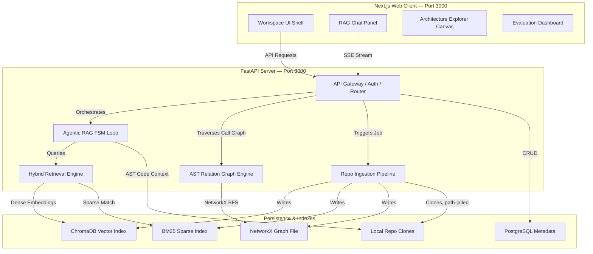

<div align="center">


<br/>

<b>Ask any question about any codebase. Get a grounded, cited answer in seconds — not hours of grepping.</b>

<br/><br/>

[](#license--intellectual-property)
[](#tech-stack)
[](#tech-stack)
[](#tech-stack)
[](#roadmap)

<br/>

[](https://github.com/HurairaMaqbool)
[](https://www.linkedin.com/in/huraira-maqbool-b696a5277/)
[](mailto:hurairac37@gmail.com)

<br/>


<br/>


<br/><br/>

</div>

---

<details open>
<summary><b>Table of Contents</b></summary>
<br/>

| # | Section | # | Section |
|---|---------|---|---------|
| 1 | [About the Project](#about-the-project) | 10 | [Design System](#design-system) |
| 2 | [Live Evaluation Metrics](#live-evaluation-metrics) | 11 | [Directory Map](#directory-map) |
| 3 | [Features](#features) | 12 | [Setup & Local Execution](#setup--local-execution) |
| 4 | [System Architecture](#system-architecture) | 13 | [Testing & Evaluation](#testing--evaluation) |
| 5 | [Agentic FSM Loop](#the-agentic-fsm-loop) | 14 | [Engineering Notes](#engineering-notes) |
| 6 | [Hybrid Retrieval Engine](#hybrid-retrieval-engine-rrf) | 15 | [Roadmap](#roadmap) |
| 7 | [Verification Firewall](#verification-firewall) | 16 | [License & IP](#license--intellectual-property) |
| 8 | [IP-Protected Prompt Loader](#ip-protected-prompt-loader) | 17 | [Author](#author) |
| 9 | [API Reference](#api-reference) | | |

</details>

---

## About the Project

**Onboarding onto an unfamiliar codebase is slow.** Engineers lose days tracing call chains, reading documentation that has already gone stale, and pinging senior developers for context that interrupts everyone's flow.

**CodeNavigator** is an agentic RAG platform built to remove that friction. Point it at a repository and it builds a **triple index** — dense embeddings, sparse keyword search, and a structural call graph — then exposes an autonomous, FSM-driven agent that answers precise, source-grounded questions about how the code actually works.

This is not a thin LLM wrapper. It is a deterministic agent loop with a hard verification stage: every claim the model produces is checked against the real file system, the AST, and the call graph before it is allowed to reach the user — and that verification layer has itself been through a full adversarial audit, not just a happy-path demo.

| | The Old Way | CodeNavigator |
|---|---|---|
| 📖 | Read docs that drift out of sync with the code | Answers are generated live from the indexed source |
| 🔍 | Grep and manually trace function calls | The graph engine resolves callers/callees via NetworkX BFS |
| 🙋 | Interrupt a senior engineer to ask "where does X happen?" | Ask the agent — it cites the exact file and line range |
| 🤞 | Trust an LLM's confident-sounding but unverified answer | Every claim passes a multi-layer grounding check; low-confidence answers are gated, not guessed |

---

## Live Evaluation Metrics

CodeNavigator ships with a built-in evaluation dashboard (`frontend-next/app/evaluation/page.tsx`) that tracks every RAGAS run, CI gate, and regression against a golden question set. The numbers below come directly from that dashboard — including the ones that aren't flattering yet.

| Metric | Value | Notes |
|---|---|---|
| Canonical adversarial suite | **27 / 27 (100%)** | Core architecture, adversarial phrasing, non-existent-feature bait, and hallucination-trap categories — 0% hallucinations, 0% unexplained abstentions |
| Golden-set CI pass rate | **10 / 10 (100%)** | Ground-truth file citation accuracy on a fully-synced index |
| RAGAS faithfulness | **0.55–0.59** *(active tuning)* | Below the 0.70 target; root-caused to chunking-granularity gaps that separate module-level context (imports, constants) from function-body chunks — being fixed at the source, not patched per-question |
| RAGAS context recall | **~0.49** *(active tuning)* | Tracked alongside faithfulness; same root cause under active investigation |
| Full test suite | **703 passed / 13 failed / 9 skipped** | 2 of the 13 failures are Groq rate-limit flakiness under bulk test runs (pass 12/12 in isolation); the remaining 11 are pre-existing test-infrastructure debt (Postgres-dependent fixtures, mock-schema drift) unrelated to retrieval or grounding logic |

> **Why show unfinished metrics:** most portfolio RAG projects report one flattering number and stop. This dashboard tracks faithfulness and recall on every run — including the ones below target — because retrieval and prompting improve with real signal, not with a badge that stops updating once it looks good. The 27/27 adversarial suite proves the *safety* layer (no hallucinations reach the user); the RAGAS numbers above are a separate, harder-to-game measure of *answer richness*, and they're allowed to say "not there yet."

---

## Features

<div align="center">

| | Feature | Description |
|---|---|---|
| 🤖 | **Agentic FSM Loop** | A deterministic `PLAN → ACT → OBSERVE → DECIDE → VERIFY → RESPOND` state machine — the LLM decides what to do next, but the loop structure prevents runaway or ungrounded behavior |
| 🔀 | **Hybrid Retrieval** | ChromaDB dense vectors + BM25 sparse keyword search, fused with Reciprocal Rank Fusion (RRF) |
| 🕸️ | **AST Relation Graph** | Tree-sitter parses the codebase into a NetworkX graph of classes, methods, and call relationships, with BFS-proximity ranking so large subgraphs render around the symbol you actually asked about |
| 🛡️ | **Multi-Layer Verification Firewall** | Every claim passes structural citation checks, AST symbol grounding, relationship grounding, and confidence scoring before release — hallucinated claims are blocked, not softened |
| 📊 | **Mermaid Diagrams** | Call subgraphs are traversed and rendered as Mermaid flowcharts directly in the Architecture Explorer |
| ⚡ | **Semantic Answer Cache** | Embedding-based cache serves repeated questions instantly within the same commit version |
| 🔒 | **IP-Protected Prompts** | A dynamic loader reads proprietary prompt templates from a private directory when present, falling back to safe operational defaults otherwise |
| 📈 | **RAGAS Evaluation** | Automated Faithfulness / Relevancy / Precision / Recall scoring with rate-limit-hardened retries and per-question drill-down |
| 🌐 | **REST + SSE API** | FastAPI backend with API-key auth, atomic quota enforcement, and Server-Sent Events for streaming agent traces and tokens |
| 🔐 | **Hardened Security Boundary** | Path-jailed file access (blocks traversal, UNC-path, and symlink escapes), SSRF-blocked ingestion URLs, and sanitized error responses that never leak internals to the client |

</div>

---

## System Architecture

CodeNavigator runs a decoupled client/server architecture. The Next.js frontend talks to the FastAPI backend over REST for standard calls and SSE for streaming agent reasoning traces and tokens.



### Ingestion Pipeline

```
Repo URL Submitted (validated against SSRF / internal-IP targets)
       │
       ▼
   Clone / Fetch  (app/ingestion/clone.py)
       │
       ▼
   File Filter    (app/ingestion/file_filter.py) — drops binaries, vendor packages, assets
       │
       ▼
   Tree-sitter Parse  (app/parsing/tree_sitter_parser.py) — functions, classes, dependencies
       │
       ▼
  ┌────────────────────────────────────────┐
  │           Parallel Indexing             │
  │  → ChromaDB   (dense embeddings)        │
  │  → BM25 store (sparse keyword index)    │
  │  → NetworkX   (call graph)              │
  └────────────────────────────────────────┘
       │
       ▼
  Re-ingestion auto-detects a prior crashed/incomplete run and forces a
  clean rebuild — no stale chunks silently linger from a failed attempt.
```

---

## The Agentic FSM Loop

The core of CodeNavigator is a **deterministic finite state machine** — not a free-form agent loop — specifically designed to keep the model grounded and bound the number of steps it can take.

```
[PLAN] ──► [ACT (Search / Read)] ──► [OBSERVE] ──► [DECIDE: Iterate?]
                                                          │
                                                          ├──► Yes ──► [PLAN]
                                                          └──► No  ──► [VERIFY] ──► [RESPOND]
```

| State | Responsibility |
|---|---|
| **PLAN** | Chooses the next logical step from the user query and conversation history |
| **ACT** | Invokes one of the agent tools — `search_code`, `view_file_snippet`, `list_calls` |
| **OBSERVE** | Collects and normalizes raw tool output |
| **DECIDE** | Decides whether enough context has been gathered (iteration cap enforced) |
| **VERIFY** | Runs every claim through the multi-layer verification firewall before release |
| **RESPOND** | Streams the final, grounded answer back to the client — or a safe abstention if verification fails |

If the LLM provider becomes unreachable mid-loop, the FSM detects the failure explicitly and transitions to a clear error state rather than hanging.

Implemented in `app/agent/loop.py`, with prompts assembled by dedicated formatters (`plan_prompt.py`, `decide_prompt.py`, `finalize_prompt.py`, `compress_prompt.py`) backed by the [IP-protected prompt loader](#ip-protected-prompt-loader).

---

## Hybrid Retrieval Engine (RRF)

Retrieval fuses semantic vector scores from ChromaDB with keyword ranks from BM25 using **Reciprocal Rank Fusion**, implemented in `app/retrieval/hybrid_search.py`:

```
RRF_Score(d) = Σ (1 / (k + r_m(d)))   for each retrieval model m in M
```

- **M** — the set of retrieval models (ChromaDB dense vectors, BM25 sparse index)
- **r_m(d)** — the 1-indexed rank of document `d` under model `m`
- **k** — smoothing constant, configured as `60`
- Documents matching test-file patterns (`/tests/`, `test_*.py`) have their rank penalized so implementation source code is prioritized over test scaffolding

---

## Verification Firewall

Every answer passes through a deterministic, multi-layer grounding check before it reaches the user — implemented in `app/agent/claim_verification.py`:

```
Final LLM Claims
       │
       ▼
Abstention & citation-presence check
       │
       ▼
Structural check — does the cited file/line range actually exist?
       │
       ▼
Lexical overlap + embedding confidence scoring
       │
       ▼
AST symbol grounding — does the claimed symbol exist in the cited code?
       │
       ▼
Relationship & literal grounding — do claimed call relationships and
literals actually appear in the graph / cited text?
       │
       ▼
Question-responsiveness & library-hallucination checks
       │
       ├── All layers pass  → return answer, citations intact
       └── Any layer fails  → strip the claim or gate the response
```

This firewall is adversarially tested, not just unit-tested: a canonical suite of hallucination traps (plausible-sounding but fabricated claims about the codebase) and non-existent-feature baits runs alongside genuine feature questions on every audit pass. Answers are never released on the strength of the model's own confidence — only on a score computed independently against the actual indexed files, AST, and call graph.

---

## IP-Protected Prompt Loader

To keep proprietary system prompts and few-shot answer-quality datasets out of the public repository, `app/agent/prompts/loader.py` implements a fallback pattern:

```
Loader → checks /private/prompts/
       → found     → reads and injects the real templates into the agent loop
       → not found → loads safe, generic fallback strings baked into the code
```

This lets the public repository run end-to-end with sane defaults while the production system uses the proprietary prompt set locally.

---

## API Reference

All requests require an `X-API-Key` header when an API key is configured. Quota checks are atomic (check-and-increment under a lock), so concurrent requests cannot race past a plan's limit.

| Method | Endpoint | Description | Request Payload | Response |
|---|---|---|---|---|
| `POST` | `/api/ingest` | Starts repository ingestion (auto-detects and cleans up any prior incomplete run) | `{ "url": "string" }` | `{ "job_id": "string", "status": "processing" }` |
| `GET` | `/api/ingest/status/{job_id}` | Polls ingestion pipeline progress | — | `{ "status": "ready\|processing\|failed", "files_parsed": 12, ... }` |
| `POST` | `/api/chat` | Queries the RAG FSM agent | `{ "message": "string", "repo_id": "string" }` | SSE stream — events: `state`, `token`, `done`, `error` |
| `GET` | `/api/symbols/{repo_id}` | Lists indexed AST symbol definitions | — | `[{ "name": "string", "path": "string", "start_line": 10 }]` |
| `GET` | `/api/diagram/{repo_id}` | Traverses method calls into a Mermaid diagram | Query: `symbol_name`, `depth` | `{ "mermaid_code": "string" }` |
| `GET` | `/api/file-snippet/{repo_id}` | Fetches a bounded, path-jailed code snippet | Query: `file_path`, `start_line`, `end_line` | `{ "code": "string", "start_line": 5, "end_line": 25 }` |
| `POST` | `/api/eval/run` | Triggers a RAGAS evaluation run | Query: `repo_id` | `{ "job_id": "string", "status": "started" }` |

In production, unhandled server errors return a generic message with a request ID for support correlation — never a raw exception string, stack trace, or internal path.

---

## Design System

CodeNavigator ships a custom **Warm Architectural Neutral** identity — Stone & Forest Olive — across both light and dark modes, defined in `frontend-next/app/globals.css`. It is a deliberate departure from the near-black-plus-neon-accent look common to AI-tool UIs: a warm, muted palette meant to read as considered and calm rather than templated.

```css
:root {
  /* Dark mode — Warm Espresso Charcoal & Sage Moss */
  --background: #171614;       /* Warm espresso charcoal base */
  --surface: #211f1c;          /* Card surface */
  --surface-raised: #2b2824;   /* Elevated cards / modals */
  --border: #3a3630;           /* Warm neutral border */
  --foreground: #f2efe9;       /* Warm off-white headings */
  --body: #c5c0b6;             /* Reading body text */
  --primary: #84a97f;          /* Muted sage-moss accent */
  --accent-foreground: #aed2a9;
}

.light {
  /* Light mode — Warm Stone Off-White & Forest Olive */
  --background: #f6f4f0;       /* Warm stone off-white base */
  --surface: #ffffff;          /* Crisp card surface */
  --border: #d8d3c8;           /* Warm stone border */
  --foreground: #1f1e1b;       /* Deep espresso headings */
  --body: #44413c;             /* Charcoal body text */
  --primary: #3b5738;          /* Deep forest olive accent */
  --accent-foreground: #2f472d;
}
```

Typography: **Plus Jakarta Sans** (display), **Inter** (body), **JetBrains Mono** (code, IDs, scores).

---

## Tech Stack

<div align="center">

| Layer | Technology | Role |
|---|---|---|
| **Backend** | FastAPI | REST API, SSE streaming, background ingestion jobs |
| **Frontend** | Next.js | Chat panel, Architecture Explorer, evaluation dashboard |
| **LLM Inference** | Groq | Agent reasoning and answer generation |
| **Vector Store** | ChromaDB | Dense embedding storage and semantic search |
| **Keyword Index** | BM25 (custom) | Exact-match symbol / keyword search |
| **Graph Engine** | NetworkX | Call graph modeling and BFS traversal |
| **AST Parser** | Tree-sitter | Language-aware function/class extraction |
| **Metadata DB** | PostgreSQL | Job, repo, and evaluation metadata |
| **Evaluation** | RAGAS | Faithfulness, relevancy, precision, recall scoring |
| **Diagrams** | Mermaid.js | Call-graph visualization |
| **Payments** | Stripe | Pricing plans and billing meters (`app/platform/billing/`) |

</div>

---

## Directory Map

```
codebase-onboarding-agent/
│
├── app/
│   ├── main.py                         ← FastAPI entry point, middleware, lifecycle
│   ├── config.py                       ← Pydantic Settings (env-driven config)
│   │
│   ├── api/
│   │   ├── router.py                   ← Ingestion / chat / graph / snippet / eval / billing routes
│   │   ├── auth.py                     ← API key + multi-tenant auth
│   │   ├── rate_limiter.py             ← Slotted-bucket rate limiting
│   │   └── state_stream.py             ← SSE generator for agent traces + tokens
│   │
│   ├── security/
│   │   └── path_jail.py                ← Path-traversal / UNC-path / symlink-escape protection
│   │
│   ├── agent/
│   │   ├── loop.py                     ← FSM agent loop (PLAN→ACT→OBSERVE→DECIDE→VERIFY→RESPOND)
│   │   ├── tools.py                    ← search_code / view_file_snippet / list_calls
│   │   ├── claim_verification.py       ← Multi-layer verification firewall
│   │   ├── grounding.py                ← Abstention detection, citation parsing
│   │   ├── semantic_cache.py           ← Embedding-based answer cache
│   │   └── prompts/
│   │       ├── loader.py               ← IP-protected prompt loader
│   │       ├── plan_prompt.py
│   │       ├── decide_prompt.py
│   │       ├── finalize_prompt.py
│   │       └── compress_prompt.py
│   │
│   ├── retrieval/
│   │   ├── embeddings.py               ← SentenceTransformers dense embeddings
│   │   ├── vector_store.py             ← ChromaDB client manager
│   │   ├── bm25_store.py               ← BM25 sparse index
│   │   └── hybrid_search.py            ← RRF fusion + test-file demotion
│   │
│   ├── graph/
│   │   └── builder.py                  ← NetworkX graph builder (classes, scopes, calls)
│   │
│   ├── diagrams/
│   │   └── mermaid_generator.py        ← AST subgraph → Mermaid flowchart, BFS-proximity ranked
│   │
│   ├── ingestion/
│   │   ├── clone.py                    ← Git URL resolution, SSRF-checked, path-jailed cloning
│   │   ├── pipeline.py                 ← Ingestion orchestration, auto-recovery from crashed runs
│   │   └── file_filter.py              ← Source vs. vendor/asset filtering
│   │
│   ├── parsing/
│   │   └── tree_sitter_parser.py       ← AST extraction (functions, classes, deps)
│   │
│   └── platform/
│       ├── usage_meter.py              ← Atomic quota check-and-increment
│       └── billing/                    ← Stripe payment + subscription management
│
├── frontend-next/
│   └── app/
│       ├── layout.tsx                  ← Global shell, fonts, theme providers
│       ├── globals.css                 ← Warm Architectural Neutral theme
│       ├── onboarding/page.tsx         ← Repo ingestion wizard
│       ├── chat/page.tsx               ← Agent RAG dialog window
│       ├── architecture/page.tsx       ← Call-graph canvas + inspector
│       └── evaluation/page.tsx         ← RAGAS score history + CI checks
│
├── eval/
│   ├── run_eval.py                     ← RAGAS evaluation runner (429-hardened)
│   └── ragas_providers.py              ← ChatGroq judge with retry-backoff
│
├── tests/                              ← Full pytest suite, including adversarial
│                                          hallucination-trap and whitebox security tests
└── start.bat                           ← One-command local startup
```

---

## Setup & Local Execution

### Prerequisites

```bash
python --version   # 3.13+
node --version     # 18+
```

### Installation

```bash
# 1. Clone the repository
git clone https://github.com/HurairaMaqbool/CodeNavigator.git
cd CodeNavigator

# 2. Create and activate a virtual environment
python -m venv .venv
.venv\Scripts\activate        # Windows
source .venv/bin/activate     # macOS / Linux

# 3. Install backend dependencies
pip install -r requirements.txt

# 4. Install frontend dependencies
cd frontend-next && npm install && cd ..

# 5. Configure environment variables
cp .env.example .env
```

Edit `.env` with your keys (`GROQ_API_KEY`, `POSTGRES_URI`, `REPOS_PATH`, model selections, search thresholds — see `app/config.py`).

### Run

```bash
# One command (Windows) — launches backend (8000) + frontend (3000)
start.bat

# Or manually, in two terminals:
uvicorn app.main:app --host 0.0.0.0 --port 8000    # Terminal 1
cd frontend-next && npm run dev                      # Terminal 2
```

| Service | URL |
|---|---|
| FastAPI Backend | http://localhost:8000 |
| API Docs (Swagger) | http://localhost:8000/docs |
| Next.js Frontend | http://localhost:3000 |

> **Containerized setup** (`docker-compose up`) is in active development — see [Roadmap](#roadmap).

---

## Testing & Evaluation

```bash
# Full test suite
pytest

# RAGAS evaluation on the golden set
python -m eval.run_eval <repo_id>

# Production frontend build
cd frontend-next && npm run build
```

RAGAS tracks **Faithfulness**, **Answer Relevancy**, **Context Precision**, and **Context Recall**, with rate-limit-hardened retries and per-question score breakdowns for debugging low-scoring runs rather than just an aggregate number.

The test suite includes dedicated adversarial coverage: hallucination traps, non-existent-feature bait (verified against the filesystem independently before judging abstention correctness), path-traversal and SSRF payloads, and a quota-race-condition stress test.

---

## Engineering Notes

A running log of non-trivial issues found and resolved, kept here rather than buried in commit history:

| # | Issue | Resolution |
|---|---|---|
| 1 | Sidebar vertical scroll breaking on long content | Fixed-positioning container restructure |
| 2 | Symbol search dropdown clipped under other panels | Applied `relative z-50` stacking wrappers |
| 3 | RAGAS chart TypeScript compile failures | Added type guards around Recharts label parsing |
| 4 | Inconsistent leading-slash paths in symbol inspector | Normalized via `.lstrip('/')` |
| 5 | Rate-limit retry loop never terminating | Raised backoff ceiling and adjusted sleep thresholds |
| 6 | RAGAS judge hitting provider rate limits | Set `max_retries > 0` on the RAGAS `ChatGroq` client |
| 7 | Evaluation "compare runs" missing older records | Matched legacy evaluations lacking `repo_id` by job ID instead |
| 8 | Verification layer's abstention detection missed novel LLM phrasings | Replaced a growing literal-string list with a general negation-pattern regex |
| 9 | HTTP 500 responses leaked raw exception text (including a case with embedded credentials) | Environment-gated error sanitization — generic message + request ID in production, full detail in dev only |
| 10 | Quota checks raced under concurrent requests in file-store mode | Added an atomic check-and-increment path with a lock, wired into every quota-checked endpoint |
| 11 | Architecture Explorer dropped the focus node from large subgraphs | Replaced alphabetical node truncation with BFS-distance-from-entry-point ranking |
| 12 | Re-ingestion after a crashed run silently mixed stale and fresh chunks | Auto-detects an unclean prior state and forces a full clean rebuild, no explicit flag required |

---

## Roadmap

```
✅  Phase 1 — Core Pipeline
    [x] Git ingestion + Tree-sitter AST chunking
    [x] Triple indexing — ChromaDB + BM25 + NetworkX
    [x] Hybrid search with Reciprocal Rank Fusion
    [x] Deterministic agentic FSM loop

✅  Phase 2 — Safety & Reliability
    [x] Multi-layer verification firewall with adversarial testing
    [x] Path-jailed file access, SSRF-checked ingestion
    [x] Atomic quota enforcement
    [x] Semantic answer cache
    [x] IP-protected prompt loader with safe fallbacks

✅  Phase 3 — Evaluation & Observability
    [x] 27-query canonical adversarial suite (0% hallucinations)
    [x] Golden-set CI at 100% pass rate
    [x] Per-question RAGAS drill-down and root-cause tooling
    [ ] RAGAS faithfulness/recall above 0.70 target (in progress —
        chunking-granularity fix underway)
    [ ] Tracing / observability integration

🔄  Phase 4 — Deployment & Extensions (in progress)
    [ ] Containerized deployment (Docker Compose) for one-command setup
        on any machine
    [ ] Additional Tree-sitter language grammars
    [ ] Multi-repo cross-codebase queries
```

---

## License & Intellectual Property

**Copyright © 2026 Huraira Maqbool. All Rights Reserved.**

This repository — including the agentic FSM loop, prompt engineering templates, verification firewall, retrieval algorithms, and system architecture — is the proprietary work of the author and is published for **learning, demonstration, and portfolio evaluation only**.

- **No commercial use** without express written permission
- **No redistribution** or rehosting of this codebase or derivatives
- **No reuse** of the prompting structure or retrieval systems without consent

For licensing or collaboration inquiries, reach out at **hurairac37@gmail.com**.

---

## Author

<div align="center">


### **Huraira Maqbool**
*AI Engineer · Agentic RAG Systems*

[](https://github.com/HurairaMaqbool)
[](https://www.linkedin.com/in/huraira-maqbool-b696a5277/)
[](mailto:hurairac37@gmail.com)

<br/>

*If CodeNavigator saved you time understanding a codebase, a star on GitHub helps other engineers find it.*

</div>

<div align="center">


<sub>Built with Python · FastAPI · Agentic RAG · NetworkX — audited harder than it's advertised.</sub>
</div>
