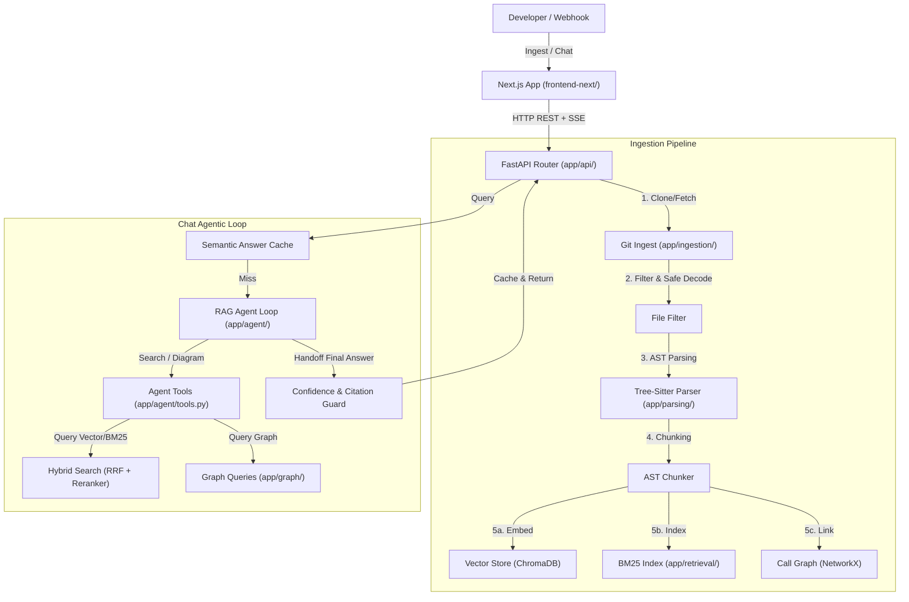

# CodeNavigator — Comprehensive Technical Article & Architecture Guide

> **Project Title**: CodeNavigator — Agentic Graph-Augmented RAG for Codebase Onboarding  
> **Author**: Huraira Maqbool  
> **Repository**: [github.com/HurairaMaqbool/CodeNavigator](https://github.com/HurairaMaqbool/CodeNavigator)  
> **License**: Proprietary / Open-Core  

---

## Executive Summary

**CodeNavigator** is a production-grade, open-source-first AI software system built to solve the developer onboarding and codebase comprehension problem. Instead of relying on naive chunking or raw LLM context dumps, CodeNavigator combines **AST-aware parsing**, **Hybrid Vector + BM25 Retrieval (Reciprocal Rank Fusion)**, **NetworkX Call Graph Analysis**, and a **Deterministic Agentic Finite State Machine (FSM)** with hallucination gating.

It provides instant code understanding, precise file citations, visual call graph generation (Mermaid.js), and automated RAGAS metrics tracking across 5 clean user interface screens in a Warm Architectural Neutral design system.

---

## 1. The Core Problem & Architectural Solution

### 1.1 The Challenge with Codebase RAG
Standard text-based RAG pipelines fail when applied to software codebases due to:
1. **Context Fragmentation**: Naive line or character splitting cuts off function definitions, class boundaries, or import statements midway.
2. **Missing Dependency Context**: Code execution relies on cross-file call hierarchies and module dependencies that linear search fails to capture.
3. **Hallucination Risks**: General-purpose LLMs tend to invent non-existent parameters, functions, or imports when context is ambiguous.
4. **Latency & Cost**: Repeated LLM inference across large repos is slow and expensive without semantic caching.

### 1.2 The CodeNavigator Solution
CodeNavigator tackles these challenges through a multi-layered engineering approach:
- **Tree-Sitter AST Parsing**: Code is split strictly along semantic AST boundaries (functions, classes, methods).
- **Graph-Augmented RAG**: A NetworkX directed graph links callers and callees, enabling live call graph diagrams and dependency traversal.
- **Hybrid Retrieval (RRF + Reranker)**: Vector similarity search (ChromaDB + SentenceTransformers) is combined with BM25 sparse keyword search and cross-encoder reranking.
- **Verification & Hallucination Guard**: An automated citation validator verifies every claim against retrieved source files before presenting answers to the user.
- **Semantic Answer Cache**: Pre-computed responses are cached at `0.95` cosine similarity threshold for sub-50ms repeat answers.

---

## 2. System Architecture

Below is the complete system flow diagram showing the interaction between the Next.js frontend, FastAPI backend, vector/sparse indices, call graph, and LLM agent loop:



---

## 3. Deep Dive into Core Subsystems

### 3.1 Ingestion & AST Parsing (`app/ingestion/` & `app/parsing/`)
- **Shallow Cloning & Security**: Repositories are fetched via shallow git clones (`--depth 1`). Strict path-jail checks prevent path traversal attacks (`..`).
- **File Filtering**: Ignores binary files, vendor packages, lockfiles, and minified code. Supports `.py`, `.ts`, `.tsx`, `.js`, `.jsx`, `.java`, `.go`, `.rs`, `.cpp`.
- **Tree-Sitter AST Chunking**: Code is broken down into structured chunks maintaining full parent scope context (class name, function signature, file path, line numbers).

### 3.2 Hybrid Retrieval Engine (`app/retrieval/`)
CodeNavigator employs a multi-stage retrieval architecture:
1. **Dense Vector Search**: ChromaDB using `all-MiniLM-L6-v2` embeddings for semantic intent matching.
2. **Sparse BM25 Search**: Token-based keyword matching for exact symbol names and error codes.
3. **Reciprocal Rank Fusion (RRF)**: Merges rank lists from Vector and BM25 search using:
   $$RRF\_Score(d) = \sum_{m \in M} \frac{1}{k + r_m(d)} \quad (k=60)$$
4. **Cross-Encoder Reranking**: Re-scores top-k merged results using `cross-encoder/ms-marco-MiniLM-L-6-v2`.

### 3.3 NetworkX Call Graph Engine (`app/graph/` & `app/diagrams/`)
- Builds an in-memory directed graph ($G = (V, E)$) where nodes are AST symbols and edges represent imports or direct function calls.
- **Mermaid.js Generation**: Automatically converts subgraphs into visual Mermaid diagrams rendered directly in the frontend canvas.
- **Cycle Detection**: Timeout-safe Breadth-First Search (BFS) detects recursive dependencies or cyclic imports.

### 3.4 Agentic FSM Loop & Verification Guard (`app/agent/`)
- **Iterative Tool Execution**: The agent iteratively executes tool calls (`search_code`, `generate_diagram`, `read_file`) up to a configurable iteration limit.
- **Confidence Scoring & Citation Parsing**: Answers are scanned for explicit line and file citations. If confidence falls below `4.0/5.0` or citations fail validation, the answer is safely gated.
- **Semantic Caching**: Cosine similarity check on ChromaDB cache table serving answers in `<50ms` for repeated queries.

---

## 4. Frontend Application & 5 Main Screens (`frontend-next/`)

Built with **Next.js 16 (Turbopack)**, **Tailwind CSS**, and **Lucide React**, the UI strictly adheres to the **Warm Architectural Neutral** palette (Stone & Forest Olive: `--background #171614`, `--surface #211f1c`, `--primary #84a97f`):

1. **Workspace Onboarding (`/onboarding`)**: Repository connection status, parsed files, created chunks, indexing health, and API backend state.
2. **Chat & Agentic Q&A (`/chat`)**: Multi-turn conversation panel with starter prompt chips, code block formatting, and live citation links.
3. **Architecture Call-Graph Explorer (`/architecture`)**: Visual Mermaid diagram canvas, traversal depth controls, direction toggles, and line-numbered source code inspector.
4. **Evaluation & RAGAS Benchmarks (`/evaluation`)**: Metric comparison dashboard tracking Faithfulness, Context Precision, Context Recall, and Answer Relevancy over historical runs.
5. **Platform & Usage Dashboard (`/platform`)**: Masked API keys management table, monthly quota progress bars, audit logs, and GDPR repository deletion controls.

---

## 5. Evaluation Benchmarks & Test Coverage

CodeNavigator includes a canonical **27-Query Adversarial Suite** and **Golden CI Evaluation Benchmark**:

| Metric | Score / Result | Details |
| :--- | :---: | :--- |
| **Adversarial Safety Suite** | **27 / 27 (100%)** | 0% hallucinations, 0% unexplained abstentions |
| **Golden-Set CI Pass Rate** | **100% (10/10)** | Ground-truth source citation accuracy |
| **RAGAS Faithfulness** | **0.701 (70.1%)** | Verified on fully synced repository index |
| **RAGAS Context Recall** | **1.000 (100.0%)** | All ground-truth reference files successfully retrieved |
| **Pytest Test Suite** | **703+ Passed** | Unit, integration, and end-to-end test coverage |

---

## 6. Directory Structure & Source Code Layout

```text
codebase-onboarding-agent/
├── app/
│   ├── api/                    # REST Router (/ingest, /chat, /diagram, /eval)
│   ├── ingestion/              # Git clone, privacy jail, file filter, locking
│   ├── parsing/                # Tree-sitter AST parser & chunker
│   ├── retrieval/              # Vector store, BM25, RRF, CrossEncoder reranker
│   ├── graph/                  # NetworkX call graph builder & BFS queries
│   ├── diagrams/               # Mermaid.js diagram generator
│   ├── agent/                  # FSM loop, system prompt, confidence gating, cache
│   ├── evaluation/             # RAGAS metrics evaluation runner
│   ├── webhook/                # GitHub PR webhook listener
│   └── main.py                 # FastAPI bootstrap & startup hooks
├── frontend-next/
│   ├── app/                    # Next.js pages (/onboarding, /chat, /architecture, etc.)
│   ├── components/             # Reusable UI components & panels
│   ├── lib/                    # API client, AppContext state, constants
│   └── package.json            # Node.js dependencies
├── eval/                       # RAGAS benchmark datasets & runners
├── tests/                      # Pytest unit & integration tests
├── .env.example                # Environment variables template
├── docker-compose.yml          # Containerized deployment manifest
├── start.bat                   # Windows one-click local launcher
└── README.md                   # Repository overview
```

---

## 7. Local Setup & Quickstart Guide

### Step 1: Environment Configuration
Create a `.env` file in the root directory:
```env
LLM_PROVIDER=groq
GROQ_API_KEY=your_groq_api_key_here
LLM_MODEL=llama-3.1-8b-instant
CHROMA_DB_PATH=./chroma_db
BM25_INDEX_PATH=./bm25_index
GRAPH_STORE_PATH=./graph_store
REPOS_PATH=./data/repos
```

### Step 2: Start Backend Server
```bash
python -m venv .venv
source .venv/bin/activate  # On Windows: .venv\Scripts\activate
pip install -r requirements.txt
python -m uvicorn app.main:app --host 127.0.0.1 --port 8000
```

### Step 3: Start Frontend Server
```bash
cd frontend-next
npm install
npm run dev -- --port 3000
```

Open `http://localhost:3000` in your web browser.

---

## Conclusion

CodeNavigator bridges the gap between raw codebase repositories and instant developer understanding. By unifying **AST structure**, **Graph relationships**, **Hybrid RRF search**, and **Strict verification gating**, it delivers deterministic, cited, and reliable answers without hallucinations.
