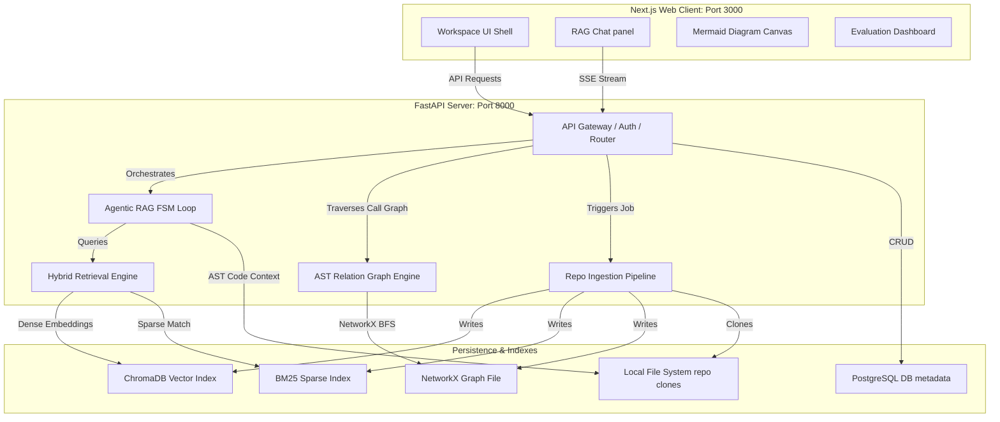

# CodeNavigator — Master Architecture, Subsystem & Interface Definition File

This document serves as the **unified, single source of truth** defining each and every component of the **CodeNavigator (Codebase Onboarding Agent)** platform. It details the system architecture, file mapping, core algorithms, database schemas, API interfaces, design tokens, resolved bugs, and operations.

---

## 1. System Architecture & Flow Chart

CodeNavigator operates on a decoupled client-server architecture. The Next.js frontend interacts with the FastAPI backend through standard REST endpoints and Server-Sent Events (SSE) for agent thinking traces and streaming answers.



---

## 2. Comprehensive Directory & File Mapping

Below is the definitive catalog of all key source files and directories within the `codebase-onboarding-agent` project, along with their engineering responsibilities:

### A. Backend Core (`app/`)
*   [`app/main.py`](file:///d:/github project/codebase-onboarding-agent/app/main.py): Entry point for the FastAPI application. Sets up middleware (CORS, rate limiting), registers API routes, mounts static assets, and handles application lifecycles.
*   [`app/config.py`](file:///d:/github project/codebase-onboarding-agent/app/config.py): Pydantic Settings class loading configuration from environment variables (e.g. `GROQ_API_KEY`, `POSTGRES_URI`, `REPOS_PATH`, model selections, search thresholds).
*   [`app/api/router.py`](file:///d:/github project/codebase-onboarding-agent/app/api/router.py): Core HTTP router mapping endpoints for ingestion, chat, call graphs, file snippets, evaluations, and billing.
*   [`app/api/auth.py`](file:///d:/github project/codebase-onboarding-agent/app/api/auth.py): API key authorization logic, user context validation, and multi-tenant security verification.
*   [`app/api/rate_limiter.py`](file:///d:/github project/codebase-onboarding-agent/app/api/rate_limiter.py): Slotted bucket rate-limiting guards preventing API abuse.
*   [`app/api/state_stream.py`](file:///d:/github project/codebase-onboarding-agent/app/api/state_stream.py): Server-Sent Events (SSE) generator producing real-time agent logic traces and token streams.
*   [`app/agent/loop.py`](file:///d:/github project/codebase-onboarding-agent/app/agent/loop.py): Implements the Finite State Machine (FSM) agent loop. Coordinates retrieval, tool invocations, synthesis, and confidence checks.
*   [`app/agent/tools.py`](file:///d:/github project/codebase-onboarding-agent/app/agent/tools.py): RAG tooling interface containing code-specific search functions, file readers, and syntax checkers.
*   [`app/agent/confidence.py`](file:///d:/github project/codebase-onboarding-agent/app/agent/confidence.py): Grounding validator scoring LLM generated answers against retrieved AST files.
*   [`app/agent/semantic_cache.py`](file:///d:/github project/codebase-onboarding-agent/app/agent/semantic_cache.py): Embeddings-based caching system for repetitive queries within the same commit version.
*   [`app/agent/prompts/loader.py`](file:///d:/github project/codebase-onboarding-agent/app/agent/prompts/loader.py): Dynamic IP-protected prompt loader reading templates from `/private/` if present, falling back to basic operational templates.
*   [`app/agent/prompts/plan_prompt.py`](file:///d:/github project/codebase-onboarding-agent/app/agent/prompts/plan_prompt.py): Formats the agent PLAN state prompt using the loader.
*   [`app/agent/prompts/decide_prompt.py`](file:///d:/github project/codebase-onboarding-agent/app/agent/prompts/decide_prompt.py): Formats the agent DECIDE state prompt using the loader.
*   [`app/agent/prompts/finalize_prompt.py`](file:///d:/github project/codebase-onboarding-agent/app/agent/prompts/finalize_prompt.py): Formats the agent FINALIZE state prompt using the loader.
*   [`app/agent/prompts/compress_prompt.py`](file:///d:/github project/codebase-onboarding-agent/app/agent/prompts/compress_prompt.py): Formats the agent OBSERVE/compress state prompt using the loader.
*   [`app/agent/prompts/answer_quality_dataset.py`](file:///d:/github project/codebase-onboarding-agent/app/agent/prompts/answer_quality_dataset.py): Handles classification and few-shot example dataset loading using the loader.
*   [`app/retrieval/embeddings.py`](file:///d:/github project/codebase-onboarding-agent/app/retrieval/embeddings.py): Dense vector generation module using `Sentence-Transformers`.
*   [`app/retrieval/vector_store.py`](file:///d:/github project/codebase-onboarding-agent/app/retrieval/vector_store.py): ChromaDB client manager managing schema instantiation, indexing, and dense queries.
*   [`app/retrieval/bm25_store.py`](file:///d:/github project/codebase-onboarding-agent/app/retrieval/bm25_store.py): BM25 sparse keyword-index implementation for exact-match symbol searches.
*   [`app/retrieval/hybrid_search.py`](file:///d:/github project/codebase-onboarding-agent/app/retrieval/hybrid_search.py): Fuses dense and sparse results using Reciprocal Rank Fusion (RRF) and demotes test files.
*   [`app/graph/builder.py`](file:///d:/github project/codebase-onboarding-agent/app/graph/builder.py): NetworkX graph builder modeling class structures, method scopes, and method calls.
*   [`app/diagrams/mermaid_generator.py`](file:///d:/github project/codebase-onboarding-agent/app/diagrams/mermaid_generator.py): Formats AST call subgraphs into Mermaid.js compatible flowchart formats.
*   [`app/ingestion/clone.py`](file:///d:/github project/codebase-onboarding-agent/app/ingestion/clone.py): Resolves git URLs, manages authentication, clones repositories, and cleans up local environments.
*   [`app/ingestion/file_filter.py`](file:///d:/github project/codebase-onboarding-agent/app/ingestion/file_filter.py): Extension and path check filter separating valid source code from vendor packages or assets.
*   [`app/parsing/tree_sitter_parser.py`](file:///d:/github project/codebase-onboarding-agent/app/parsing/tree_sitter_parser.py): Syntactic parser using tree-sitter bindings to extract functions, classes, dependencies, and code range metadata.
*   [`app/platform/billing/`](file:///d:/github project/codebase-onboarding-agent/app/platform/billing): Manages Stripe payment gateways, pricing plan subscriptions, and billing meters.

### B. Frontend Architecture (`frontend-next/`)
*   [`frontend-next/app/layout.tsx`](file:///d:/github project/codebase-onboarding-agent/frontend-next/app/layout.tsx): Base HTML shell setting up the global design fonts, theme providers, and UI structures.
*   [`frontend-next/app/globals.css`](file:///d:/github project/codebase-onboarding-agent/frontend-next/app/globals.css): Configures the "Midnight Studio" CSS system, tailwind components, and scroll utilities.
*   [`frontend-next/app/onboarding/page.tsx`](file:///d:/github project/codebase-onboarding-agent/frontend-next/app/onboarding/page.tsx): Input wizard mapping target repository URLs to trigger backend ingestion.
*   [`frontend-next/app/chat/page.tsx`](file:///d:/github project/codebase-onboarding-agent/frontend-next/app/chat/page.tsx): CodeNavigator agent RAG dialog window displaying step indicators and citations.
*   [`frontend-next/app/architecture/page.tsx`](file:///d:/github project/codebase-onboarding-agent/frontend-next/app/architecture/page.tsx): Graph canvas visualizing call graphs and code inspection side panels.
*   [`frontend-next/app/evaluation/page.tsx`](file:///d:/github project/codebase-onboarding-agent/frontend-next/app/evaluation/page.tsx): Runs evaluation metrics, showing RAGAS score histories and CI checks.
*   [`frontend-next/components/workspace/node-detail-panel.tsx`](file:///d:/github project/codebase-onboarding-agent/frontend-next/components/workspace/node-detail-panel.tsx): Detailed inspector slide-out displaying method parameters, return types, and code snippets.
*   [`frontend-next/components/evaluation/ragas-chart.tsx`](file:///d:/github project/codebase-onboarding-agent/frontend-next/components/evaluation/ragas-chart.tsx): Custom bar chart visualization mapping evaluation runs.

---

## 3. Subsystem Core Algorithms

### A. Reciprocal Rank Fusion (RRF) Hybrid Search
The retrieval system fuses semantic vector scores from ChromaDB and keyword ranks from BM25 using Reciprocal Rank Fusion:

\[
RRF\_Score(d) = \sum_{m \in M} \frac{1}{k + r_m(d)}
\]

Where:
*   \(M\) represents the set of retrieval models (Chroma Vector, BM25).
*   \(r_m(d)\) is the rank of document \(d\) in model \(m\) (1-indexed).
*   \(k\) is a smoothing constant (configured as `60`).
*   Additionally, any document containing test patterns (e.g. `/tests/`, `test_*.py`) has its rank penalized to prioritize implementation source code.

### B. Agentic Finite State Machine (FSM)
The agent runs a deterministic state loop to prevent hallucinations:

```
[PLAN] ──► [ACT (Search/Read)] ──► [OBSERVE] ──► [DECIDE (Iterate?)]
                                                     │
                                                     ├──► (Yes) ──► [PLAN]
                                                     └──► (No)  ──► [VERIFY] ──► [RESPOND]
```

1.  **PLAN**: Selects the next logical step based on user query and history.
2.  **ACT**: Invokes tools (`search_code`, `view_file_snippet`, `list_calls`).
3.  **OBSERVE**: Collects raw output from tools.
4.  **DECIDE**: Determines if enough data is collected to formulate an answer (limits iterations to `5`).
5.  **VERIFY**: Matches generated code citations against actual filesystem line limits. If invalid, sanitizes them.
6.  **RESPOND**: Compiles the final grounded answer and stream tokens to client.

### C. Intellectual Property Protection Loader
To prevent exposing proprietary system prompts and answer quality datasets, a loader pattern checks for local files and loads fallbacks:
```
Loader -> Checks `/private/prompts/` -> Reads files -> Replaces in Agent Loop
       -> If `/private/` is missing  -> Loads secure fallback strings in code
```

### D. RAGAS & Agent Rate-Limit Hardening (HTTP-429 Retry)
1.  **Per-Question Retry Loop**: In `eval/run_eval.py`, if a rate limit exception is hit (`rate_limited: True` or HTTP 429), it calculates backoff with a default wait of 4s, parsing Groq hint messages (e.g., "wait 4 seconds") and using exponential backoff ($hint \times 2^{attempt}$, capped at 20s) up to 5 attempts.
2.  **RAGAS Judge automatic retries**: In `eval/ragas_providers.py`, `ChatGroq` is initialized with `max_retries` matching the configured settings rather than `0`, allowing Langchain's client to handle rate-limit retry-backoff automatically during judge operations.

---

## 4. Complete API Endpoint Catalog

All requests must contain authentication headers if an API Key is configured (`X-API-Key: <key>`).

| Method | Endpoint | Description | Request Payload | Response Model |
| :--- | :--- | :--- | :--- | :--- |
| **POST** | `/api/ingest` | Initiates repo ingestion | `{"url": "string"}` | `{"job_id": "string", "status": "processing"}` |
| **GET** | `/api/ingest/status/{job_id}` | Polls ingestion pipeline steps | None | `{"status": "ready\|processing\|failed", "files_parsed": 12, ...}` |
| **POST** | `/api/chat` | Queries the RAG FSM agent | `{"message": "string", "repo_id": "string"}` | SSE Stream (Events: `state`, `token`, `done`, `error`) |
| **GET** | `/api/symbols/{repo_id}` | Fetches indexed AST symbol definitions | None | `[{"name": "string", "path": "string", "start_line": 10}]` |
| **GET** | `/api/diagram/{repo_id}` | Traverses method calls to yield Mermaid code | QueryParams: `symbol_name`, `depth` | `{"mermaid_code": "string"}` |
| **GET** | `/api/file-snippet/{repo_id}` | Retrieves code snippet within file bounds | QueryParams: `file_path`, `start_line`, `end_line` | `{"code": "string", "start_line": 5, "end_line": 25}` |
| **POST** | `/api/eval/run` | Triggers RAGAS evaluations on golden set | QueryParams: `repo_id` | `{"job_id": "string", "status": "started"}` |

---

## 5. Design System Tokens (Midnight Studio Dark Theme)

Defined in [`frontend-next/app/globals.css`](file:///d:/github project/codebase-onboarding-agent/frontend-next/app/globals.css):

```css
:root {
  --background: 240 10% 3.9%;      /* Deep Charcoal (#0a0a0a) */
  --foreground: 0 0% 98%;          /* Clean White */
  --card: 240 10% 5.9%;            /* Matte Gray */
  --border: 240 5.9% 15%;          /* Fine Border Accent */
  
  --primary: 263.4 70% 50.4%;      /* Royal Violet (#8b5cf6) */
  --primary-foreground: 210 20% 98%;
  
  --success: 142.1 76.2% 36.3%;    /* Forest Green */
  --warning: 37.9 90.2% 50.2%;     /* Warning Amber */
  --destructive: 0 72.2% 50.6%;    /* Alert Red */
}
```

---

## 6. Resolved Production Blocker Bugs

1.  **Sidebar Vertical Scroll Issue**: Fixed by using fixed positioning container setup.
2.  **Symbol Search Z-Index Clipping**: Stacking layer solved by applying `relative z-50` wrappers.
3.  **RAGAS Chart Label Parsing Compile Fault**: Handled Recharts TypeScript compilation errors via type-guards.
4.  **Symbol Inspector Leading Slash Bug**: Solved path prefix inconsistencies via `.lstrip('/')`.
5.  **Rate Limit Death Loop**: Resolved by increasing default backoff max ceiling and sleep thresholds.
6.  **RAGAS Judge Rate Limits**: Solved by setting `max_retries` greater than 0 on the RAGAS ChatGroq client.
7.  **Evaluation Compare Runs Missing ID Filters**: Solved by matching historical evaluations missing `repo_id` with job ID values.

---

## 7. Operations Runbook

### Prerequisites
*   Python 3.12+ installed.
*   Node.js 18+ installed.

### Execution
Run the system using the workspace batch scripts:
*   **Startup**: Run [`start.bat`](file:///d:/github project/codebase-onboarding-agent/start.bat) to launch the backend (port 8000) and Next.js dev server (port 3000).
*   **Test Suite**: Run `pytest` to execute all unit tests.
*   **RAGAS Evaluator**: Run `python -m eval.run_eval <repo_id>` to run evaluation.
*   **Production Build**: Run `npm run build` inside `frontend-next/` to compile optimized production assets.
